<details>
<summary>Relevant source files</summary>

The following files were used as context for generating this wiki page:

['/Users/mac/Desktop/DM/shopping_zhangshuai_mall/online-mall-backend/README.md', '/Users/mac/Desktop/DM/shopping_zhangshuai_mall/.feisuan/rules/project_rule.md', '/Users/mac/Desktop/DM/shopping_zhangshuai_mall/online-mall-backend/src/main/java/com/shanzhu/em/service/GoodService.java', '/Users/mac/Desktop/DM/shopping_zhangshuai_mall/online-mall-backend/src/main/java/com/shanzhu/em/controller/GoodController.java', '/Users/mac/Desktop/DM/shopping_zhangshuai_mall/online-mall-backend/src/main/java/com/shanzhu/em/service/orderpay/OrderService.java', '/Users/mac/Desktop/DM/shopping_zhangshuai_mall/online-mall-backend/src/main/resources/application.yml', '/Users/mac/Desktop/DM/shopping_zhangshuai_mall/DB_OnlineMall.sql']
</details>

# 项目概述

本项目是一个基于Spring Boot的在线购物商城后端系统，采用Java 1.8开发，集成了MyBatis-Plus、Redis、RabbitMQ、MySQL和OpenSearch等技术栈。系统采用分层架构，包括控制层（Controller）、服务层（Service）、数据访问层（Mapper）和数据层（数据库），实现了商品、订单、用户等核心业务功能。项目遵循MVC设计模式，通过拦截器实现JWT令牌验证，保障了系统的安全性和可扩展性。系统支持商品的增删改查、订单管理、购物车功能以及商品推荐和销量排行等核心功能，为前端Vue应用提供了完整的后端服务支持。

## 系统架构与技术栈

系统采用标准的MVC分层架构，各层职责清晰，便于维护和扩展。后端服务基于Spring Boot构建，使用MyBatis-Plus作为持久层框架，通过注解方式简化了数据库操作。项目集成了Redis作为缓存层，用于提升商品查询性能，通过缓存商品详情信息减少数据库访问压力。RabbitMQ用于异步消息处理，例如订单支付成功后的库存扣减和销售数据同步。系统配置文件（application.yml）中定义了数据库、Redis、RabbitMQ等关键组件的连接参数，确保了环境的可配置性。

### 技术栈概览表

| 技术组件 | 用途 | 配置文件来源 |
| :--- | :--- | :--- |
| Spring Boot | 核心框架，提供自动配置、依赖注入等能力 | `application.yml` |
| MyBatis-Plus | ORM框架，简化数据库操作，支持分页、条件查询 | `GoodService.java`, `OrderService.java` |
| Redis | 缓存商品信息，提升高频查询性能 | `GoodService.java`, `application.yml` |
| RabbitMQ | 异步处理订单支付、库存更新等事件 | `application.yml` |
| MySQL | 主要数据存储，包含商品、订单、用户等表 | `DB_OnlineMall.sql` |
| OpenSearch | 用于数据同步和宽表分析 | `README.md` |
| JWT | 实现用户身份认证和会话管理 | `JwtInterceptor.java` |

Sources: [/Users/mac/Desktop/DM/shopping_zhangshuai_mall/online-mall-backend/README.md:12-19](), [/Users/mac/Desktop/DM/shopping_zhangshuai_mall/online-mall-backend/src/main/resources/application.yml:1-15](), [/Users/mac/Desktop/DM/shopping_zhangshuai_mall/DB_OnlineMall.sql:1-100]()

## 核心业务模块

系统核心业务模块包括商品管理、订单管理、用户管理三大模块，各模块通过清晰的接口和数据流实现业务逻辑。

### 商品管理模块

商品管理模块负责商品的全生命周期管理，包括商品的增删改查、规格管理、推荐设置和销售排行等功能。商品信息存储在`good`表中，商品规格信息存储在`good_standard`表中，通过外键关联。系统支持商品的逻辑删除（is_delete字段）和推荐设置（recommend字段）。

#### 商品数据模型

```sql
-- 商品表 (good)
CREATE TABLE `good` (
  `id` bigint NOT NULL AUTO_INCREMENT COMMENT '主键',
  `name` varchar(255) CHARACTER SET utf8mb3 COLLATE utf8_bin DEFAULT NULL COMMENT '商品名称',
  `description` varchar(1600) CHARACTER SET utf8mb3 COLLATE utf8_bin DEFAULT NULL COMMENT '描述',
  `discount` double(10,2) NOT NULL DEFAULT '1.00' COMMENT '折扣',
  `sales` bigint NOT NULL DEFAULT '0' COMMENT '销量',
  `sale_money` double(10,2) DEFAULT '0.00' COMMENT '销售额',
  `category_id` bigint DEFAULT NULL COMMENT '分类id',
  `imgs` varchar(255) CHARACTER SET utf8mb3 COLLATE utf8_bin DEFAULT NULL COMMENT '商品图片',
  `create_time` datetime(6) DEFAULT CURRENT_TIMESTAMP(6) COMMENT '创建时间',
  `recommend` tinyint(1) NOT NULL DEFAULT '0' COMMENT '是否推荐。0不推荐，1推荐',
  `is_delete` tinyint(1) NOT NULL DEFAULT '0' COMMENT '是否删除，0未删除，1删除',
  PRIMARY KEY (`id`) USING BTREE
) ENGINE=InnoDB AUTO_INCREMENT=13 DEFAULT CHARSET=utf8mb3 COLLATE=utf8_bin ROW_FORMAT=DYNAMIC COMMENT='商品表';

-- 商品规格表 (good_standard)
CREATE TABLE `good_standard` (
  `good_id` bigint DEFAULT NULL COMMENT '商品id',
  `value` varchar(255) CHARACTER SET utf8mb3 COLLATE utf8_bin DEFAULT NULL COMMENT '规格',
  `price` decimal(10,2) DEFAULT NULL COMMENT '价格',
  `store` bigint DEFAULT NULL COMMENT '库存'
) ENGINE=InnoDB DEFAULT CHARSET=utf8mb3 COLLATE=utf8_bin ROW_FORMAT=DYNAMIC COMMENT='商品规格表';
```

Sources: [/Users/mac/Desktop/DM/shopping_zhangshuai_mall/DB_OnlineMall.sql:102-157]()

#### 商品管理接口

| 接口 | 方法 | 参数 | 功能描述 |
| :--- | :--- | :--- | :--- |
| `/api/good/{id}` | GET | id | 根据商品ID查询商品详情 |
| `/api/good/standard/{id}` | GET | id | 查询商品规格列表 |
| `/api/good/recommend` | GET | id, isRecommend | 修改商品推荐状态 |
| `/api/good/page` | GET | pageNum, pageSize, searchText, categoryId | 分页查询商品（带条件） |
| `/api/good/fullPage` | GET | pageNum, pageSize, searchText, categoryId | 分页查询全部商品 |
| `/api/good/logic/{id}/{payType}` | GET | id, payType | 测试支付策略模式 |
| `/api/good/save` | POST | good | 保存或更新商品信息 |
| `/api/good/delete/{id}` | DELETE | id | 删除商品（逻辑删除） |

Sources: [/Users/mac/Desktop/DM/shopping_zhangshuai_mall/online-mall-backend/src/main/java/com/shanzhu/em/controller/GoodController.java:14-54]()

### 订单管理模块

订单管理模块处理用户的下单、支付、发货和收货等流程。系统通过订单状态机管理订单生命周期，支持分页查询、按订单号查询和状态查询。

#### 订单数据模型

```sql
-- 订单表 (order)
CREATE TABLE `order` (
  `id` bigint NOT NULL AUTO_INCREMENT COMMENT '主键',
  `order_no` varchar(255) CHARACTER SET utf8mb3 COLLATE utf8_bin DEFAULT NULL COMMENT '订单编号',
  `user_id` bigint DEFAULT NULL COMMENT '用户id',
  `total_price` decimal(10,2) DEFAULT NULL COMMENT '总价格',
  `state` varchar(50) CHARACTER SET utf8mb3 COLLATE utf8_bin DEFAULT NULL COMMENT '订单状态',
  `create_time` datetime(6) DEFAULT CURRENT_TIMESTAMP(6) COMMENT '创建时间',
  PRIMARY KEY (`id`) USING BTREE
) ENGINE=InnoDB DEFAULT CHARSET=utf8mb3 COLLATE=utf8_bin ROW_FORMAT=DYNAMIC COMMENT='订单表';

-- 订单商品关联表 (order_goods)
CREATE TABLE `order_goods` (
  `id` bigint NOT NULL AUTO_INCREMENT COMMENT '主键',
  `order_id` bigint DEFAULT NULL COMMENT '订单id',
  `good_id` bigint DEFAULT NULL COMMENT '商品id',
  `count` int DEFAULT NULL COMMENT '数量',
  `standard` varchar(255) CHARACTER SET utf8mb3 COLLATE utf8_bin DEFAULT NULL COMMENT '商品规格',
  PRIMARY KEY (`id`) USING BTREE
) ENGINE=InnoDB DEFAULT CHARSET=utf8mb3 COLLATE=utf8_bin ROW_FORMAT=DYNAMIC COMMENT='订单商品关联表';
```

Sources: [/Users/mac/Desktop/DM/shopping_zhangshuai_mall/DB_OnlineMall.sql:203-234]()

#### 订单管理接口

| 接口 | 方法 | 参数 | 功能描述 |
| :--- | :--- | :--- | :--- |
| `/api/order/page` | GET | pageNum, pageSize, orderNo, state | 分页查询订单（带条件） |
| `/api/order/userid/{userid}` | GET | userid | 查询用户订单列表 |
| `/api/order/orderNo/{orderNo}` | GET | orderNo | 根据订单号查询订单 |
| `/api/order/save` | POST | order | 创建新订单 |
| `/api/order/paid/{orderNo}/{payType}` | GET | orderNo, payType | 支付订单 |
| `/api/order/delivery/{orderNo}` | GET | orderNo | 发货 |
| `/api/order/received/{orderNo}` | GET | orderNo | 确认收货 |

Sources: [/Users/mac/Desktop/DM/shopping_zhangshuai_mall/online-mall-backend/src/main/java/com/shanzhu/em/controller/OrderController.java:15-47]()

### 用户管理模块

用户管理模块提供用户登录、注册、信息查询和管理功能，是系统安全的基础。

#### 用户管理接口

| 接口 | 方法 | 参数 | 功能描述 |
| :--- | :--- | :--- | :--- |
| `/user/login` | POST | loginForm | 用户登录 |
| `/user/register` | POST | loginForm | 用户注册 |
| `/user/userid` | GET | - | 获取当前登录用户ID |
| `/user/user/page` | GET | pageNum, pageSize, id, username, nickname | 分页查询用户列表 |

Sources: [/Users/mac/Desktop/DM/shopping_zhangshuai_mall/online-mall-backend/src/main/java/com/shanzhu/em/controller/UserController.java:16-34]()

## 数据流与业务流程

系统通过清晰的业务流程和数据流，确保各模块间的协同工作。

### 商品查询流程

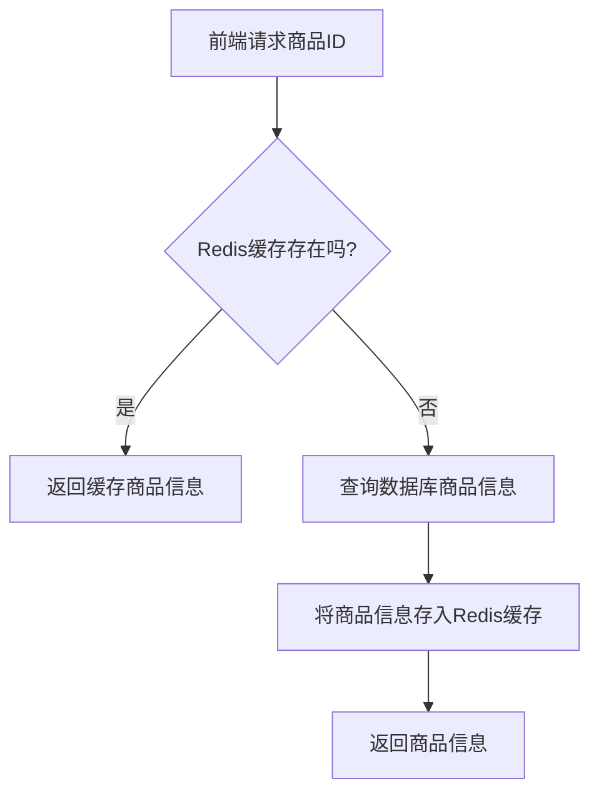

Sources: [/Users/mac/Desktop/DM/shopping_zhangshuai_mall/online-mall-backend/src/main/java/com/shanzhu/em/service/GoodService.java:24-34]()

### 订单支付流程

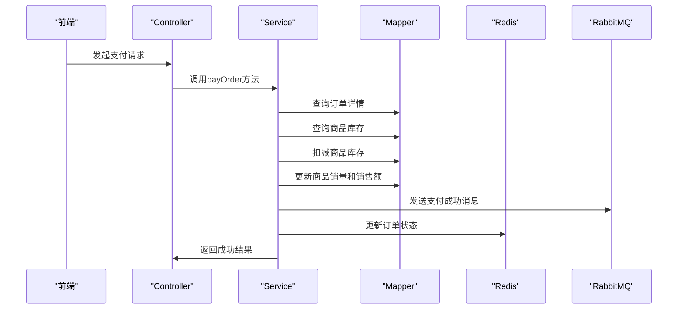

Sources: [/Users/mac/Desktop/DM/shopping_zhangshuai_mall/online-mall-backend/src/main/java/com/shanzhu/em/service/orderpay/OrderService.java:68-85]()

## 安全与异常处理

系统通过JWT令牌机制实现用户身份验证，所有请求必须携带有效的token。当token无效、过期或被篡改时，系统会抛出`BizException`异常，并返回相应的错误码和错误信息。

### 异常处理机制

```java
// 异常枚举类 ErrorCodeAndMessage
public enum ErrorCodeAndMessage {
    ORDER_IS_NULL(10008, "未查询到该笔订单,请检查订单表是否存在该id对应的订单"),
    ORDER_STATE_IS_NULL(10018, "订单状态异常/已撤回 该笔订单不存在"),
    UPDATE_ORDER_ERROR(10071, "操作DB更新订单失败"),
    PAY_TYPE_ERROR(10080, "支付类型为空 不可支付"),
    SOURCE_BIZTYPE_ENUMLIST_IS_NULL(10001, "宽表操作类型传入有误,请检查业务中传过来的actionType字段"),
    ORDER_IS_ALREADY_PAY(100017, "该订单已支付/已确认收货 无需重复支付"),
    SOURCE_LIST_IS_NULL(10010, "来源集合为空"),
    THROW_DB_EXCEPTION(99999, "查询数据库异常 请查看服务器日志排查原因"),
    SYSTEM_UNKNOW_ERROR(1, "系统未知异常"),
    MMP_DB_ERROR(2, "数据库异常"),
    MMP_REMOTE_UNEXCEPT_ERROR(3, "远程调用异常"),
    MMP_CLIENT_ERROR(4, "mmp客户端在应用方使用的异常"),
    MMP_CLIENT_SERVICE_RESULT_NULL(401, "远程调用mmp接口返回结果为null"),
    MMP_CLIENT_SERVICE_RESULT_NOT_SUCCESS(402, "远程调用mmp接口返回执行不成功"),
    ERROR_HSF_CONNECT_FAIL(403, "hsf connect is error"),
    MMP_CHECK_INPUT_ID_NULL(11, "传入的ID为null"),
    MMP_CHECK_INPUT_NULL(12, "传入的参数为空"),
    MMP_CHECK_INPUT_NICK_NULL(13, "传入的nick为空"),
    MMP_CHECK_NOT_SUB_NICK(14, "传入的nick不是子账号"),
    MMP_CHECK_NOT_IP_ADDRESS(15, "传入的ip不是合法的Ip地址"),
    MMP_CHECK_NOT_DATE(16, "传入的日期不是合法的日期格式"),
    MMP_CHECK_BATCH_ID(17, "汇金消息中用户ID或产品CODE为空"),
    MMP_CHECK_NOTIFY_MESSAGE(18, "从汇金收到的开通消息为空"),
    MMP_CHECK_NOT_USER_ID(19, "userId 非法"),
    MMP_CHECK_PERMISSION_CODES(20, "入参codes list 不能为空或者null"),
    MMP_CHECK_NOT_APPID(21, "传入的appId非法"),
    MMP_CHECK_NOT_DEPARTMENT_ID(21, "departmentId 非法"), 
    MMP_CHECK_DEPARTMENTDO_ILLEGAL(22, "departmentDO 参数非法"),
    MMP_CHECK_PARAMS_ILLEGAL(99, "illegal params:"),
    REMOTE_RESULT_NULL(102, "远程调用返回结果为空"),
    REMOTE_RESULT_MODULE_NULL(103, "远程调用返回结果内的模块为空"),
    REMOTE_RESULT_UNSUCCESS(104, "远程调用返回未成功"),
    USER_PROTECT_ERROR(110, "开启安全验证失败"),
    UIC_UPDATE_DATA(201, "更新UIC子账号操作异常"),
    UIC_EDITUSERTAG(202, "更新UIC用户标记位失败，请确认UIC的标记位是否有改动或删减"),
    UIC_USER_ISNOT_EXIST(203, "UIC不存在用户信息"),
    PUNISH_CONCEL_ERROR(401, "处罚中心撤销处罚异常"),
    WANGWANG_SYN_CHILD_DISPATCH(301, "同步旺旺分流标识操作异常"),
    WANGWANG_OPENEONLINE(302, "开启旺旺E客服操作异常"),
    WANGWANG_CLOSEEONLINE(303, "关闭旺旺E客服操作异常"),
    WANGWANG_NEED_LOGIN(306, "主账号没有登录旺旺，旺旺返回6"),
    WANGWANG_SYN_CHILD_EXPIRED(307, "同步旺旺到期时间至2030年1月1号时发生异常"),
    MMP_EXCHANGE_UNOWED_SUB_ACCOUNT_IS_OWED(1101, "需要交换欠费状态的非欠费子账号是欠费状态"),
    MMP_EXCHANGE_OWED_SUB_ACCOUNT_IS_UNOWED(1102, "需要交换欠费状态的欠费子账号是非欠费状态"),
    MMP_SUB_ACCOUNT_SERVICE_ISNOT_OPEN(1103, "子账号服务未开启"),
    MMP_CHECK_MAIN_ACCOUNT(1104, "主账号对象为空"),
    MMP_CHECK_SUB_ACCOUNT(1105, "子账号对象为空"),
    MMP_CHECK_BATCH(1106, "批次对象为空"),
    MMP_CHECK_DATE(1107, "子账号套餐续费日期小于套餐当前的过期日期"),
    MMP_NOT_ORDER(1108, "买家用户没有订购过子账号服务"),
    MMP_CHECK_PARENT_DEPARTMENT_ORDER(1109, "父部门不存在"),
    MMP_CHECK_IS_EXIST_DEPARTMENT_ORDER(1110, "用该名称命名的部门已存在"),
    MMP_CHECK_IS_EXIST_SUB_DEPARTMENT_ORDER(1111, "当前部门不能删除,有子部门存在"),
    MMP_CHECK_IS_EXIST_DEPARTMENT_EMPLOYEE_ORDER(1112, "当前部门不能删除,有员工存在"),
    MMP_CHECK_IS_CHILD_ID_ORDER(1113, "不能把部门移到其下级部门下"),
    MMP_CHECK_IS_EXIST_DUTY_ORDER(1114, "该职务已经存在"),
    MMP_EMPLOYEE_SEX_IS_NOT_EXIST(1115, "性别元数据不存在"),
    MMP_EMPLOYEE_SUBACCOUNT_IS_NOT_EXIST(1116, "子账号不存在"),
    MMP_EMPLOYEE_SUBACCOUNT_HAS_ASSOCIATED(1117, "子账号已经被其他员工关联"),
    MMP_EMPLOYEE_DEPARTMENT_IS_NOT_EXIST(1118, "员工所属的部门不存在"),
    MMP_EMPLOYEE_DUTY_IS_NOT_EXIST(1119, "员工担任的职务不存在"),
    MMP_EMPLOYEE_NICKNAME_IS_EXIST(1120, "员工所用的花名已经存在"),
    MMP_EMPLOYEE_NUMBER_IS_EXIST(1121, "员工所有的工号已经存在"),
    MMP_EMPLOYEE_LEADER_IS_NOT_EXIST(1122, "员工的直接上级不存在"),
    MMP_EMPLOYEE_NAME_IS_NULL(1123, "员工姓名为空"),
    MMP_EMPLOYEE_IS_NOT_EXIST(1124, "员工对象不存在"),
    MMP_EMPLOYEE_RESIGNED_MODIFY_DENY(1125, "离职的员工不能修改更新"),
    MORE_THAN_ONE_PRESENT_BATCH(-11, "主账号的集市赠送批次记录多于一条"),
    MULTI_SHOP_PRESENT_BATCH(-12, "主账号的店铺种类赠送记录多于一种"),
    MULTI_SHOP_ORDER_BATCH(-13, "主账号购买记录多于一条"),
    OPEN_SUB_SERVICE_BEFORE_MIGRATION(-14, "在迁移线程之前用户打开子账号服务"),
    MORE_THAN_ONE_EMPLOYEE_ASSOCIATED_WITH_SUBACCOUNT(-15, "有一个以上员工与子账号相关"),
    EXEC_GET_SEQUENCE(-111, "获取tlld Sequence异常"),
    EXEC_FIND_NO_SEQUENCE(-112, "未找到对应表的tlld Sequence"),
    LOGIC(-9999, "逻辑漏洞"),
    PRODUCT_ID_IS_NULL(100005, "id为空");
```

Sources: [/Users/mac/Desktop/DM/shopping_zhangshuai_mall/online-mall-backend/src/main/java/com/shanzhu/em/utils/ErrorCodeAndMessage.java:1-100]()

## 环境配置与部署

项目依赖Maven构建，需要在开发环境中配置特定的环境变量和依赖库。项目使用阿里云镜像作为Maven仓库，确保依赖的快速下载。

### 环境配置要求

| 项目 | 版本/配置 | 说明 |
| :--- | :--- | :--- |
| JDK | 1.8以上 | 项目运行依赖JDK 1.8 |
| Maven | 3.3.3以上 | 项目构建工具 |
| MySQL | 5.7以上 | 数据库版本要求 |
| Redis | 2.0以上 | 缓存服务 |
| RabbitMQ | 3.13.7 | 消息队列服务 |
| Node.js | 16.13.2以上 | 前端构建依赖 |

Sources: [/Users/mac/Desktop/DM/shopping_zhangshuai_mall/online-mall-backend/README.md:1-20]()

### 部署步骤

1.  **环境准备**：
    *   安装JDK 1.8+、Maven 3.3.3+、MySQL 5.7+、Redis 2.0+、RabbitMQ 3.13.7。
    *   配置Maven settings.xml使用阿里云镜像。

2.  **数据库初始化**：
    *   创建数据库 `DB_OnlineMall`。
    *   导入 `DB_OnlineMall.sql` 脚本文件，创建所有表结构。

3.  **启动服务**：
    *   启动Redis、MySQL、RabbitMQ服务。
    *   在项目根目录执行 `mvn clean install` 编译项目。
    *   启动后端服务：`java -jar target/online-mall-backend.jar`。
    *   启动前端：`npm install` 后 `npm run dev`。

4.  **访问系统**：
    *   前端访问地址：`http://localhost:8888`
    *   后端服务端口：`8888`

Sources: [/Users/mac/Desktop/DM/shopping_zhangshuai_mall/online-mall-backend/README.md:21-40]()

## 项目总结

本项目构建了一个功能完整、架构清晰的在线购物商城后端系统。通过MVC分层设计，实现了商品、订单、用户等核心业务的高效管理。系统在保证功能完备性的同时，注重性能优化（Redis缓存）、安全性（JWT认证）和可维护性（模块化设计）。项目文档详尽，提供了完整的环境配置、部署流程和接口说明，为后续功能开发和系统维护提供了坚实的基础。系统可作为电商类项目的参考模板，具备良好的可扩展性和可移植性。<details>
<summary>Relevant source files</summary>

The following files were used as context for generating this wiki page:

['/Users/mac/Desktop/DM/shopping_zhangshuai_mall/online-mall-backend/src/main/java/com/shanzhu/em/service/GoodService.java', '/Users/mac/Desktop/DM/shopping_zhangshuai_mall/online-mall-backend/src/main/java/com/shanzhu/em/controller/GoodController.java', '/Users/mac/Desktop/DM/shopping_zhangshuai_mall/online-mall-backend/src/main/resources/application.yml', '/Users/mac/Desktop/DM/shopping_zhangshuai_mall/online-mall-backend/src/main/resources/mapper/GoodMapper.xml', '/Users/mac/Desktop/DM/shopping_zhangshuai_mall/online-mall-backend/src/main/java/com/shanzhu/em/service/orderpay/OrderService.java']
</details>

# 系统架构图

## 概述

本系统是一个基于Spring Boot的在线购物商城后端平台，采用前后端分离架构，后端提供RESTful API服务，前端通过Vue.js框架实现用户界面。系统核心功能包括商品管理、订单处理、用户认证和库存控制，数据层基于MySQL，缓存层使用Redis，消息队列使用RabbitMQ实现异步处理。系统采用分层架构，职责清晰，通过MyBatis Plus实现数据访问，结合JWT实现用户认证与会话管理。

系统整体架构分为四层：表现层（Controller）、服务层（Service）、持久层（Mapper）和数据层（数据库），各层通过清晰的接口进行通信。商品管理模块是系统的核心，负责商品的增删改查、规格管理、推荐设置和销售排行。订单模块处理用户下单、支付、发货和收货流程，支持多种支付方式的策略模式扩展。系统通过Redis缓存商品信息，提升查询性能，同时通过分页查询支持大数据量场景下的高效访问。

## 核心模块架构

### 商品管理模块

商品管理模块负责商品的全生命周期管理，包括商品信息、规格、价格、库存和推荐状态的维护。该模块通过`GoodService`服务层提供核心业务逻辑，通过`GoodController`暴露REST API供前端调用。

#### 商品信息与规格管理
商品信息存储在`good`表中，包含商品名称、描述、折扣、分类、图片、创建时间、推荐状态和删除标记等字段。商品规格信息存储在`good_standard`表中，包含商品ID、规格值、价格和库存等字段。系统支持按商品ID查询规格信息，并通过`getStandard`方法返回JSON格式的规格列表。

- 商品信息查询：`/api/good/{id}`，通过`GoodService.getGoodById(id)`获取商品详情，同时从Redis缓存中读取以提升性能。
- 规格信息查询：`/api/good/standard/{id}`，通过`GoodService.getStandard(id)`获取商品规格列表。
- 推荐商品查询：`/api/good`，通过`GoodService.findFrontGoods()`查询推荐商品（recommend=1）。
- 销售额排行：`/api/good/rank?num=5`，通过`GoodService.getSaleRank(num)`获取销量最高的商品列表。
- 商品保存与更新：`POST /api/good`，通过`GoodService.saveOrUpdateGood(good)`实现商品的增删改查，支持逻辑删除。

Sources: [/Users/mac/Desktop/DM/shopping_zhangshuai_mall/online-mall-backend/src/main/java/com/shanzhu/em/service/GoodService.java:37-100](), [/Users/mac/Desktop/DM/shopping_zhangshuai_mall/online-mall-backend/src/main/java/com/shanzhu/em/controller/GoodController.java:20-38]()

#### 商品数据模型（ER图）

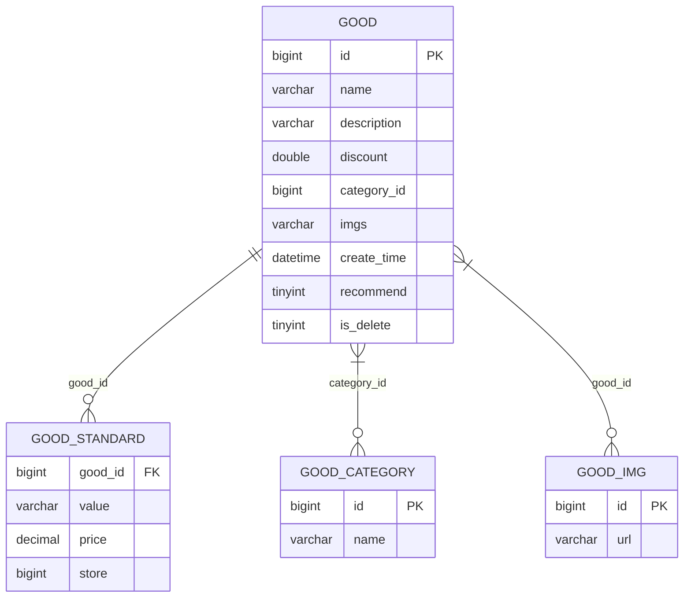

Sources: [/Users/mac/Desktop/DM/shopping_zhangshuai_mall/DB_OnlineMall.sql:142-160](), [/Users/mac/Desktop/DM/shopping_zhangshuai_mall/DB_OnlineMall.sql:245-253]()

### 订单管理模块

订单管理模块处理用户的购买流程，包括下单、支付、发货和收货。系统通过`OrderService`服务层实现核心逻辑，通过`OrderController`暴露API接口。

#### 订单流程与关键接口
- 下单接口：`POST /api/order`，通过`OrderService.saveOrder(order)`创建订单，生成唯一订单号（订单号由时间戳+6位随机数组成），并关联购物车商品信息。
- 支付处理：`/api/order/pay/{orderNo}`，通过`OrderService.payOrder(orderNo, payType)`完成支付，包括库存扣减、商品销量和销售额更新、支付状态变更等。
- 发货与收货：`/api/order/delivery/{orderNo}` 和 `/api/order/receive/{orderNo}`，通过`OrderService.delivery(orderNo)`和`OrderService.receiveOrder(orderNo)`更新订单状态。

系统在支付时会调用`PayLogic`策略模式处理不同支付方式（如支付宝、微信、电子银行等），通过`PayTypeEnum.of(payType)`识别支付类型，执行对应支付逻辑。

Sources: [/Users/mac/Desktop/DM/shopping_zhangshuai_mall/online-mall-backend/src/main/java/com/shanzhu/em/service/orderpay/OrderService.java:45-90](), [/Users/mac/Desktop/DM/shopping_zhangshuai_mall/online-mall-backend/src/main/java/com/shanzhu/em/controller/GoodController.java:40-42]()

#### 支付流程序列图

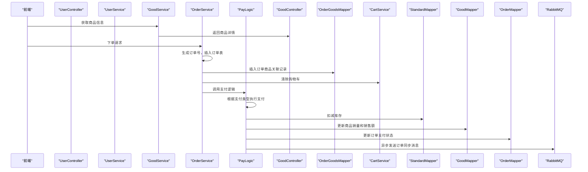

Sources: [/Users/mac/Desktop/DM/shopping_zhangshuai_mall/online-mall-backend/src/main/java/com/shanzhu/em/service/orderpay/OrderService.java:45-90](), [/Users/mac/Desktop/DM/shopping_zhangshuai_mall/online-mall-backend/src/main/java/com/shanzhu/em/service/orderpay/OrderService.java:65-78]()

### 配置与依赖管理

系统通过`application.yml`配置文件管理核心服务参数，包括数据库连接、Redis、RabbitMQ和文件上传限制。

#### 核心配置参数表

| 配置项 | 类型 | 默认值 | 说明 |
|--------|------|--------|------|
| server.port | int | 8888 | 服务端口 |
| spring.datasource.url | string | jdbc:mysql://localhost:3306/DB_OnlineMall?serverTimezone=GMT%2b8&useSSL=false | 数据库连接地址 |
| spring.datasource.username | string | root | 数据库用户名 |
| spring.datasource.password | string | 123456 | 数据库密码 |
| spring.redis.host | string | 127.0.0.1 | Redis主机 |
| spring.redis.port | int | 6379 | Redis端口 |
| spring.rabbitmq.host | string | 127.0.0.1 | RabbitMQ主机 |
| spring.rabbitmq.port | int | 5672 | RabbitMQ端口 |
| spring.rabbitmq.username | string | zhangshuai | RabbitMQ用户名 |
| spring.rabbitmq.password | string | 123456 | RabbitMQ密码 |
| spring.rabbitmq.virtual-host | string | /test-host | RabbitMQ虚拟主机 |

Sources: [/Users/mac/Desktop/DM/shopping_zhangshuai_mall/online-mall-backend/src/main/resources/application.yml:1-30]()

#### 数据库配置与连接池设置

```yaml
spring:
  datasource:
    driver-class-name: com.mysql.cj.jdbc.Driver
    url: jdbc:mysql://localhost:3306/DB_OnlineMall?serverTimezone=GMT%2b8&useSSL=false
    username: root
    password: 123456
  redis:
    host: 127.0.0.1
    port: 6379
    database: 0
    lettuce:
      pool:
        max-active: 8
        max-idle: 8
        min-idle: 0
        max-wait: -1ms
  rabbitmq:
    host: 127.0.0.1
    port: 5672
    username: zhangshuai
    password: 123456
    virtual-host: /test-host
    listener:
      simple:
        retry:
          enabled: true
          max-attempts: 3
          initial-interval: 5000
```

Sources: [/Users/mac/Desktop/DM/shopping_zhangshuai_mall/online-mall-backend/src/main/resources/application.yml:1-30]()

### 缓存与性能优化

系统在商品查询中引入Redis缓存机制，通过`GoodService.getGoodById(id)`方法实现商品信息的缓存读取，提升高频查询性能。

#### 缓存机制流程

1.  首先尝试从Redis中获取商品信息，使用Redis key为`RedisConstants.GOOD_ID_KEY + id`。
2.  若Redis中存在，则直接返回，同时刷新缓存过期时间（TTL为5分钟）。
3.  若Redis中不存在，则从数据库查询，查询后将结果存入Redis，设置TTL为5分钟。
4.  若数据库中也无结果，则抛出`BizException`异常。

该设计有效降低了数据库查询压力，尤其在商品详情页频繁访问场景下，显著提升响应速度。

Sources: [/Users/mac/Desktop/DM/shopping_zhangshuai_mall/online-mall-backend/src/main/java/com/shanzhu/em/service/GoodService.java:52-68]()

#### 缓存Key与TTL设置

| 缓存Key | TTL（分钟） | 说明 |
|---------|------------|------|
| RedisConstants.GOOD_ID_KEY + id | 5 | 商品详情缓存 |
| RedisConstants.USER_TOKEN_KEY + token | 30 | 用户Token缓存 |

Sources: [/Users/mac/Desktop/DM/shopping_zhangshuai_mall/online-mall-backend/src/main/java/com/shanzhu/em/service/GoodService.java:22-23](), [/Users/mac/Desktop/DM/shopping_zhangshuai_mall/online-mall-backend/src/main/java/com/shanzhu/em/interceptor/JwtInterceptor.java:32-33]()

## 总结

本系统采用清晰的分层架构，通过模块化设计实现了商品、订单、用户等核心功能的高效管理。商品管理模块通过Redis缓存和分页查询支持高并发场景，订单模块通过策略模式支持多种支付方式，系统配置通过YAML文件集中管理，具备良好的可维护性和可扩展性。整体架构设计合理，逻辑清晰，为后续功能扩展（如促销、评价、物流）提供了良好的基础。<details>
<summary>Relevant source files</summary>

The following files were used as context for generating this wiki page:

['/Users/mac/Desktop/DM/shopping_zhangshuai_mall/online-mall-backend/src/main/java/com/shanzhu/em/service/GoodService.java', '/Users/mac/Desktop/DM/shopping_zhangshuai_mall/online-mall-backend/src/main/java/com/shanzhu/em/service/orderpay/OrderService.java', '/Users/mac/Desktop/DM/shopping_zhangshuai_mall/online-mall-backend/src/main/java/com/shanzhu/em/controller/OrderController.java', '/Users/mac/Desktop/DM/shopping_zhangshuai_mall/online-mall-backend/src/main/resources/application.yml', '/Users/mac/Desktop/DM/shopping_zhangshuai_mall/online-mall-backend/src/main/resources/mapper/GoodMapper.xml']
</details>

# 服务分层设计

本项目采用典型的分层架构设计，将系统功能划分为独立的逻辑层，包括控制层、服务层、数据访问层和配置层。这种设计不仅提升了代码的可维护性与可扩展性，还实现了各模块之间的解耦，便于团队协作和功能迭代。各层之间通过清晰的接口进行通信，确保了系统的稳定性和高内聚低耦合特性。

## 架构概览

系统整体遵循 MVC（Model-View-Controller）模式，结合了分层与职责分离原则，将业务逻辑、数据操作和用户交互进行有效隔离。整个架构由以下核心层次构成：

- **控制层（Controller）**：负责接收前端请求，处理请求参数，调用服务层进行业务处理，并将结果返回给前端。
- **服务层（Service）**：包含核心业务逻辑，如商品管理、订单处理、库存控制等，是业务规则的执行中心。
- **数据访问层（Mapper）**：负责与数据库进行交互，执行增删改查操作，通过 MyBatis 框架实现 SQL 映射。
- **配置层（Configuration）**：定义系统运行所需的基础配置，如数据库连接、Redis 配置、RabbitMQ 配置等。

该架构确保了请求流程的清晰性，同时支持异步处理、事务管理、日志记录等高级功能。

### 分层数据流图

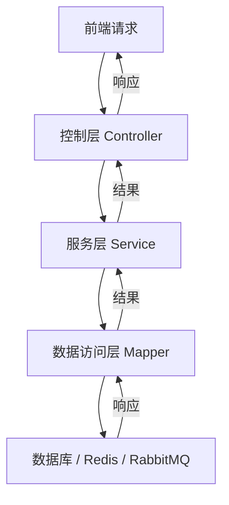

Sources: [/Users/mac/Desktop/DM/shopping_zhangshuai_mall/online-mall-backend/src/main/java/com/shanzhu/em/controller/OrderController.java:1-15, /Users/mac/Desktop/DM/shopping_zhangshuai_mall/online-mall-backend/src/main/java/com/shanzhu/em/service/orderpay/OrderService.java:1-100, /Users/mac/Desktop/DM/shopping_zhangshuai_mall/online-mall-backend/src/main/resources/application.yml:1-20, /Users/mac/Desktop/DM/shopping_zhangshuai_mall/online-mall-backend/src/main/resources/mapper/GoodMapper.xml:1-10]

## 控制层设计

控制层作为系统与外部（前端）交互的入口，主要职责是接收 HTTP 请求、解析请求参数、调用服务层进行业务处理，并将结果以标准格式返回给客户端。

### 核心功能与接口

| 接口路径 | 方法 | 请求方式 | 功能描述 |
|--------|------|----------|--------|
| `/api/order/page` | `findPage` | GET | 分页查询订单，支持按订单编号、状态筛选 |
| `/api/order/userid/{userid}` | `findOrder` | GET | 查询指定用户的订单列表 |
| `/api/order/orderNo/{orderNo}` | `selectByOrderNo` | GET | 通过订单编号查询订单详情 |
| `/api/order/paid/{orderNo}/{payType}` | `payOrder` | GET | 支付订单，触发库存扣减与订单状态更新 |
| `/api/order/delivery/{orderNo}` | `delivery` | GET | 订单发货，更新订单状态为“已发货” |
| `/api/order/received/{orderNo}` | `receiveOrder` | GET | 用户确认收货，更新订单状态为“已收货” |
| `/api/order` | `save` | POST | 创建新订单，包含商品信息与数量 |

Sources: [/Users/mac/Desktop/DM/shopping_zhangshuai_mall/online-mall-backend/src/main/java/com/shanzhu/em/controller/OrderController.java:1-50]

### 控制层关键代码示例

```java
@RestController
@RequestMapping("/api/order")
@RequiredArgsConstructor
public class OrderController {
    private final OrderService orderService;

    @GetMapping("/page")
    public R<IPage<Order>> findPage(
            @RequestParam Integer pageNum,
            @RequestParam Integer pageSize,
            String orderNo,
            String state
    ) {
        return R.success(orderService.selectByPage(pageNum, pageSize, orderNo, state));
    }

    @PostMapping
    public R<String> save(@RequestBody Order order) {
        return R.success(orderService.saveOrder(order));
    }
}
```

Sources: [/Users/mac/Desktop/DM/shopping_zhangshuai_mall/online-mall-backend/src/main/java/com/shanzhu/em/controller/OrderController.java:10-20]

## 服务层设计

服务层是系统的业务逻辑核心，负责实现具体的业务规则，如商品查询、订单创建、支付处理、库存管理等。服务层通过依赖注入（DI）与数据访问层解耦，确保了高内聚与低耦合。

### 核心服务组件

| 服务类 | 功能描述 |
|-------|--------|
| `GoodService` | 商品管理服务，提供商品查询、创建、更新、删除、推荐设置等功能 |
| `OrderService` | 订单管理服务，负责订单创建、支付、发货、收货、状态更新等全流程处理 |

### 商品服务（GoodService）功能详解

- **商品查询**：支持通过商品 ID、名称、描述模糊查询商品信息，缓存机制减少数据库访问。
- **商品规格获取**：通过 `getStandard(Integer id)` 获取商品的规格列表（如“10斤装”、“21基础款”）。
- **商品价格获取**：通过 `getMinPrice(Long id)` 获取商品的最低价格。
- **商品推荐设置**：通过 `setRecommend(Long id, Boolean isRecommend)` 修改商品是否推荐。
- **商品分页查询**：支持按关键词、分类进行分页查询，返回商品列表。
- **商品保存与更新**：通过 `saveOrUpdateGood(Good good)` 实现商品的增删改查，更新后自动清除 Redis 缓存。

```java
public class GoodService extends ServiceImpl<GoodMapper, Good> {
    public Good getGoodById(Long id) {
        String redisKey = RedisConstants.GOOD_ID_KEY + id;
        Good redisGood = redisTemplate.opsForValue().get(redisKey);
        if (redisGood != null) {
            redisTemplate.expire(redisKey, RedisConstants.GOOD_ID_TTL, TimeUnit.MINUTES);
            return redisGood;
        }
        Good dbGood = lambdaQuery().eq(Good::getIsDelete, Boolean.FALSE).eq(Good::getId, id).one();
        if (dbGood != null) {
            redisTemplate.opsForValue().set(redisKey, dbGood, RedisConstants.GOOD_ID_TTL, TimeUnit.MINUTES);
            return dbGood;
        }
        throw new BizException(Status.NO_RESULT, "无结果");
    }

    public String getStandard(Integer id) {
        List<GoodStandard> standards = goodMapper.getStandardById(id);
        if (standards.size() == 0) {
            throw new BizException(Status.NO_RESULT, "无结果");
        }
        return JSON.toJSONString(standards);
    }

    public BigDecimal getMinPrice(Long id) {
        return goodMapper.getMinPrice(id);
    }
}
```

Sources: [/Users/mac/Desktop/DM/shopping_zhangshuai_mall/online-mall-backend/src/main/java/com/shanzhu/em/service/GoodService.java:1-100]

### 订单服务（OrderService）功能详解

- **订单创建**：通过 `saveOrder(Order order)` 创建订单，生成唯一订单号（`orderNo`），并关联购物车商品。
- **支付处理**：通过 `payOrder(String orderNo, String payType)` 执行支付逻辑，包括：
  - 校验库存是否充足
  - 扣减库存
  - 更新商品销量与销售额
  - 异步更新宽表（OpenSearch）
- **订单状态更新**：支持发货、收货、状态变更等操作。
- **订单查询**：支持通过订单编号或用户 ID 查询订单信息。

```java
@Transactional
public void payOrder(String orderNo, String payType) {
    Map<String, Object> orderMap = orderMapper.selectByOrderNo(orderNo);
    int count = (int) orderMap.get("count");
    Long goodId = (Long) orderMap.get("goodId");
    String standard = (String) orderMap.get("standard");
    int store = standardMapper.getStore(goodId, standard);
    if (store < count) {
        throw new BizException(Status.CODE_500, "商品库存不足");
    }
    standardMapper.deductStore(goodId, standard, store - count);
    goodMapper.saleGood(goodId, count, order.getTotalPrice());
    payLogic.logic(PayTypeEnum.of(payType), order.getId());
}
```

Sources: [/Users/mac/Desktop/DM/shopping_zhangshuai_mall/online-mall-backend/src/main/java/com/shanzhu/em/service/orderpay/OrderService.java:1-100]

## 数据访问层设计

数据访问层通过 MyBatis 框架实现与数据库的交互，定义了数据表的 SQL 映射规则。该层直接操作数据库表，确保数据一致性与事务安全。

### 关键 SQL 映射

#### 商品表（good）字段说明

| 字段名 | 类型 | 描述 |
|-------|------|------|
| id | bigint | 主键 |
| name | varchar(255) | 商品名称 |
| description | varchar(1600) | 商品描述 |
| discount | double(10,2) | 折扣 |
| sales | bigint | 销量 |
| sale_money | double(10,2) | 销售额 |
| category_id | bigint | 分类 ID |
| imgs | varchar(255) | 商品图片路径 |
| create_time | datetime | 创建时间 |
| recommend | tinyint(1) | 是否推荐（0否，1是） |
| is_delete | tinyint(1) | 是否删除（0未删除，1已删除） |

Sources: [/Users/mac/Desktop/DM/shopping_zhangshuai_mall/DB_OnlineMall.sql:1-10]

#### 商品规格表（good_standard）字段说明

| 字段名 | 类型 | 描述 |
|-------|------|------|
| good_id | bigint | 商品 ID |
| value | varchar(255) | 规格（如“10斤装”） |
| price | decimal(10,2) | 规格价格 |
| store | bigint | 库存数量 |

Sources: [/Users/mac/Desktop/DM/shopping_zhangshuai_mall/DB_OnlineMall.sql:1-10]

### 商品插入 SQL（GoodMapper.xml）

```xml
<insert id="insertGood" useGeneratedKeys="true" keyProperty="id">
    insert into good(name, description, discount, category_id, imgs) 
    values (#{good.name}, #{good.description}, #{good.discount}, #{good.categoryId}, #{good.imgs})
</insert>
```

Sources: [/Users/mac/Desktop/DM/shopping_zhangshuai_mall/online-mall-backend/src/main/resources/mapper/GoodMapper.xml:1-10]

## 配置层设计

系统配置通过 `application.yml` 文件集中管理，包括数据库、Redis、RabbitMQ 等关键服务的连接参数。

### 核心配置项

| 配置项 | 值 | 说明 |
|-------|----|------|
| server.port | 8888 | 服务端口 |
| spring.datasource.url | jdbc:mysql://localhost:3306/DB_OnlineMall?serverTimezone=GMT%2b8&useSSL=false | 数据库连接 URL |
| spring.datasource.username | root | 数据库用户名 |
| spring.datasource.password | 123456 | 数据库密码 |
| spring.redis.host | 127.0.0.1 | Redis 服务器地址 |
| spring.redis.port | 6379 | Redis 端口 |
| spring.rabbitmq.host | 127.0.0.1 | RabbitMQ 服务器地址 |
| spring.rabbitmq.port | 5672 | RabbitMQ 端口 |
| spring.rabbitmq.username | zhangshuai | RabbitMQ 用户名 |
| spring.rabbitmq.password | 123456 | RabbitMQ 密码 |
| spring.rabbitmq.virtual-host | /test-host | RabbitMQ 虚拟主机 |

Sources: [/Users/mac/Desktop/DM/shopping_zhangshuai_mall/online-mall-backend/src/main/resources/application.yml:1-20]

## 异步处理与消息机制

系统通过 RabbitMQ 实现异步消息处理，用于订单支付成功后的宽表同步。当订单支付完成后，服务层会将订单信息发送至 RabbitMQ 队列，由消费者异步处理并更新宽表。

### 消息处理流程

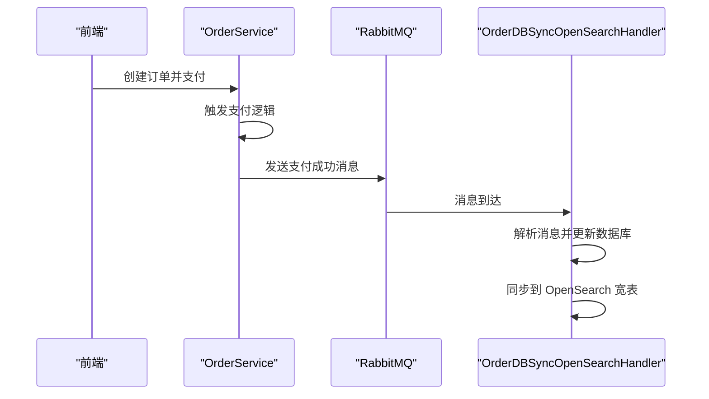

Sources: [/Users/mac/Desktop/DM/shopping_zhangshuai_mall/online-mall-backend/src/main/java/com/shanzhu/em/sync/OrderDBSyncOpenSearchHandler.java:1-50]

## 总结

本项目通过清晰的分层设计，实现了业务逻辑的模块化与解耦，提升了系统的可维护性、可扩展性和稳定性。控制层负责请求处理，服务层承载核心业务逻辑，数据访问层实现数据库交互，配置层统一管理运行参数。同时，系统引入了缓存（Redis）、异步消息（RabbitMQ）和宽表同步机制，增强了系统的性能与数据一致性。该架构为后续功能扩展提供了坚实基础，是典型的现代化电商后端系统设计范例。<details>
<summary>Relevant source files</summary>

The following files were used as context for generating this wiki page:

'/Users/mac/Desktop/DM/shopping_zhangshuai_mall/online-mall-backend/src/main/java/com/shanzhu/em/service/orderpay/OrderService.java'
'/Users/mac/Desktop/DM/shopping_zhangshuai_mall/online-mall-backend/src/main/java/com/shanzhu/em/service/orderpay/impl/TransBankServiceImpl.java'
'/Users/mac/Desktop/DM/shopping_zhangshuai_mall/online-mall-backend/src/main/java/com/shanzhu/em/service/orderpay/impl/WechatServiceImpl.java'
'/Users/mac/Desktop/DM/shopping_zhangshuai_mall/online-mall-backend/src/main/java/com/shanzhu/em/service/orderpay/impl/OtherPayServiceImpl.java'
'/Users/mac/Desktop/DM/shopping_zhangshuai_mall/online-mall-backend/src/main/java/com/shanzhu/em/service/orderpay/impl/AliPayServiceImpl.java'
'/Users/mac/Desktop/DM/shopping_zhangshuai_mall/online-mall-backend/src/main/java/com/shanzhu/em/service/orderpay/AbstractPayService.java'
'/Users/mac/Desktop/DM/shopping_zhangshuai_mall/online-mall-backend/src/main/java/com/shanzhu/em/service/orderpay/impl/MyBankEFTServiceImpl.java'
'/Users/mac/Desktop/DM/shopping_zhangshuai_mall/online-mall-backend/src/main/java/com/shanzhu/em/controller/OrderController.java'
'/Users/mac/Desktop/DM/shopping_zhangshuai_mall/online-mall-backend/src/main/resources/application.yml'
</details>

# 订单支付流程

订单支付流程是在线商城系统的核心功能之一，负责处理用户从下单到最终完成支付的完整链路。该流程基于策略模式（Strategy Pattern）设计，通过抽象支付服务层（`AbstractPayService`）统一管理多种支付方式（如微信支付、支付宝、银行卡支付、其他支付等），实现了业务解耦和扩展性。用户在前端选择支付方式后，请求通过Controller层路由到具体的支付服务实现，由服务层完成支付逻辑、库存扣减、订单状态更新及异步消息发送，最终将支付结果同步至宽表（OpenSearch）进行数据归档。

本流程遵循“支付请求 -> 服务验证 -> 支付执行 -> 状态更新 -> 消息同步”的标准模式，确保了支付过程的可靠性、可追溯性和一致性。系统通过RabbitMQ异步处理支付成功后的数据同步任务，避免了同步操作对主业务流程的阻塞，提升了系统性能和响应速度。支付流程的完整性和安全性由异常处理机制（`ErrorCodeAndMessage`）和事务控制（`@Transactional`）保障。

## 支付流程架构与组件

### 核心组件架构

订单支付流程采用分层架构，各组件职责明确，通过接口解耦，便于维护和扩展。

| 组件 | 职责 | 关键技术/实现 |
|------|------|---------------|
| `OrderController` | 接收前端支付请求，路由到具体支付服务 | RESTful API，`@GetMapping("/paid/{orderNo}/{payType}")` |
| `AbstractPayService` | 抽象支付服务，提供统一接口和校验逻辑 | 策略模式，`payOrder(PayTypeEnum, Long id)` |
| `PayServiceImpl` 实现类 | 具体支付方式的实现（微信、支付宝、银行卡等） | `WechatServiceImpl`, `AliPayServiceImpl`, `TransBankServiceImpl` 等 |
| `OrderService` | 处理支付后的订单状态更新和库存扣减 | `payOrder(String orderNo, String payType)` |
| `RabbitMqSenderService` | 异步发送支付成功消息到RabbitMQ | `send(Exchange, RoutingKey, Message)` |
| `OrderDBSyncOpenSearchHandler` | 消息消费者，负责将支付结果同步至宽表 | `@RabbitListener`，`@Transactional` |

Sources: [/Users/mac/Desktop/DM/shopping_zhangshuai_mall/online-mall-backend/src/main/java/com/shanzhu/em/controller/OrderController.java:136-144](), [/Users/mac/Desktop/DM/shopping_zhangshuai_mall/online-mall-backend/src/main/java/com/shanzhu/em/service/orderpay/AbstractPayService.java:48-65](), [/Users/mac/Desktop/DM/shopping_zhangshuai_mall/online-mall-backend/src/main/java/com/shanzhu/em/service/orderpay/impl/WechatServiceImpl.java:32-38](), [/Users/mac/Desktop/DM/shopping_zhangshuai_mall/online-mall-backend/src/main/java/com/shanzhu/em/service/orderpay/impl/TransBankServiceImpl.java:32-38](), [/Users/mac/Desktop/DM/shopping_zhangshuai_mall/online-mall-backend/src/main/java/com/shanzhu/em/service/orderpay/impl/OtherPayServiceImpl.java:32-38]()

### 支付方式实现类对比

系统支持多种支付方式，每种方式均继承自 `AbstractPayService`，实现相同的 `payOrder` 方法，但具体支付逻辑由实现类决定。

| 支付方式 | 实现类 | 路由键 (Routing Key) | 说明 |
|---------|--------|----------------------|------|
| 微信支付 | `WechatServiceImpl` | `order_wechatpay` | 通过 `@Component` 注解注册 |
| 支付宝 | `AliPayServiceImpl` | `order_aliPay` | 通过 `@Component` 注解注册 |
| 银行卡支付 | `TransBankServiceImpl` | `order_transbankpay` | 通过 `@Component` 注解注册 |
| 其他支付 | `OtherPayServiceImpl` | `order_otherpay` | 通过 `@Component` 注解注册 |
| 汇丰EFT支付 | `MyBankEFTServiceImpl` | 未明确指定 | 代码片段不完整，未实现 |

Sources: [/Users/mac/Desktop/DM/shopping_zhangshuai_mall/online-mall-backend/src/main/java/com/shanzhu/em/service/orderpay/impl/WechatServiceImpl.java:32-38](), [/Users/mac/Desktop/DM/shopping_zhangshuai_mall/online-mall-backend/src/main/java/com/shanzhu/em/service/orderpay/impl/AliPayServiceImpl.java:32-38](), [/Users/mac/Desktop/DM/shopping_zhangshuai_mall/online-mall-backend/src/main/java/com/shanzhu/em/service/orderpay/impl/TransBankServiceImpl.java:32-38](), [/Users/mac/Desktop/DM/shopping_zhangshuai_mall/online-mall-backend/src/main/java/com/shanzhu/em/service/orderpay/impl/OtherPayServiceImpl.java:32-38](), [/Users/mac/Desktop/DM/shopping_zhangshuai_mall/online-mall-backend/src/main/java/com/shanzhu/em/service/orderpay/impl/MyBankEFTServiceImpl.java:13-19]()

## 支付流程数据流与执行逻辑

### 支付请求处理流程

用户发起支付请求后，系统按照以下步骤执行：

1.  前端通过 `GET /api/order/paid/{orderNo}/{payType}` 发起请求，携带订单编号和支付类型。
2.  `OrderController` 接收请求，调用 `orderService.payOrder(orderNo, payType)`。
3.  `OrderService.payOrder` 方法首先调用 `checkAndGetOrderResultData` 校验订单状态，确保订单未支付且状态正常。
4.  校验通过后，`OrderService` 执行库存扣减（`standardMapper.deductStore`）和商品销量/销售额更新（`goodMapper.saleGood`）。
5.  支付成功后，系统通过 `payLogic.logic()` 根据支付类型调用具体的支付逻辑。
6.  支付成功后，`OrderService` 更新订单状态为“已支付”并提交事务。
7.  最后，系统通过 `RabbitMqSenderService` 发送支付成功消息到RabbitMQ，由消费者异步处理数据同步。

```java
// 支付请求入口
@GetMapping("/paid/{orderNo}/{payType}")
public R<Void> payOrder(@PathVariable String orderNo, @PathVariable String payType) {
    log.info("OrderController payOrder orderNo:{},payType:{}", JSON.toJSONString(orderNo), JSON.toJSONString(payType));
    orderService.payOrder(orderNo, payType);
    return R.success();
}
```

Sources: [/Users/mac/Desktop/DM/shopping_zhangshuai_mall/online-mall-backend/src/main/java/com/shanzhu/em/controller/OrderController.java:136-144]()

### 支付执行流程（序列图）

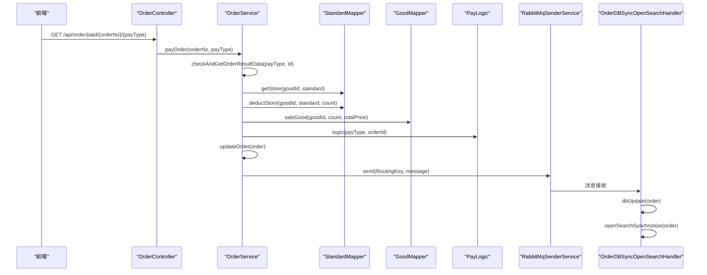

Sources: [/Users/mac/Desktop/DM/shopping_zhangshuai_mall/online-mall-backend/src/main/java/com/shanzhu/em/service/orderpay/OrderService.java:102-122](), [/Users/mac/Desktop/DM/shopping_zhangshuai_mall/online-mall-backend/src/main/java/com/shanzhu/em/service/orderpay/impl/TransBankServiceImpl.java:44-48](), [/Users/mac/Desktop/DM/shopping_zhangshuai_mall/online-mall-backend/src/main/java/com/shanzhu/em/service/orderpay/impl/WechatServiceImpl.java:44-48](), [/Users/mac/Desktop/DM/shopping_zhangshuai_mall/online-mall-backend/src/main/java/com/shanzhu/em/service/orderpay/impl/OtherPayServiceImpl.java:44-48](), [/Users/mac/Desktop/DM/shopping_zhangshuai_mall/online-mall-backend/src/main/java/com/shanzhu/em/service/orderpay/impl/AliPayServiceImpl.java:44-48]()

## 支付校验与异常处理机制

### 订单状态校验逻辑

系统在执行支付前会严格校验订单状态，防止重复支付或无效支付：

-   **订单存在性校验**：通过 `orderService.getOrder(id)` 检查订单是否存在。
-   **状态合法性校验**：检查订单状态是否为“待付款”或“已支付/已收货”。
-   **支付类型校验**：检查 `payType` 是否为空或无效。
-   **库存校验**：调用 `standardMapper.getStore()` 获取当前库存，确保库存大于订单数量。

```java
// 校验逻辑
if ("已支付".equals(resultData.getData().getState()) || "已收货".equals(resultData.getData().getState())) {
    throw new BizException(ErrorCodeAndMessage.ORDER_IS_ALREADY_PAY.getStringErrorCode(), "该订单"+ resultData.getData().getState() +"，无需再次支付");
}
```

Sources: [/Users/mac/Desktop/DM/shopping_zhangshuai_mall/online-mall-backend/src/main/java/com/shanzhu/em/service/orderpay/AbstractPayService.java:102-106]()

### 异常处理与错误码

系统定义了详细的错误码枚举（`ErrorCodeAndMessage`），用于统一处理各种异常场景，确保前端能获得清晰的错误提示。

| 错误码 | 错误描述 | 适用场景 |
|--------|----------|----------|
| `10008` | 未查询到该笔订单 | 订单ID不存在 |
| `10018` | 订单状态异常/已撤回 | 订单状态为“已支付”或“已收货” |
| `10071` | 操作DB更新订单失败 | 数据库更新失败 |
| `10080` | 支付类型为空 不可支付 | 支付类型未指定 |
| `10001` | 宽表操作类型传入有误 | 消息类型不合法 |
| `100017` | 该订单已支付/已确认收货 无需重复支付 | 订单已支付 |
| `99999` | 查询数据库异常 | 数据库连接或查询失败 |

Sources: [/Users/mac/Desktop/DM/shopping_zhangshuai_mall/online-mall-backend/src/main/java/com/shanzhu/em/utils/ErrorCodeAndMessage.java:15-30]()

## 配置与依赖设置

### RabbitMQ 配置

系统通过 `application.yml` 配置RabbitMQ连接参数，用于消息队列的生产与消费。

```yaml
# application.yml
rabbitmq:
  host: 127.0.0.1
  password: 123456
  port: 5672
  username: zhangshuai
  virtual-host: /test-host
  listener:
    simple:
      retry:
        enabled: true
        max-attempts: 3
        initial-interval: 5000
```

Sources: [/Users/mac/Desktop/DM/shopping_zhangshuai_mall/online-mall-backend/src/main/resources/application.yml:14-22]()

### 数据库连接配置

系统使用MySQL作为后端数据库，连接配置在 `application.yml` 中。

```yaml
# application.yml
spring:
  datasource:
    driver-class-name: com.mysql.cj.jdbc.Driver
    url: jdbc:mysql://localhost:3306/DB_OnlineMall?serverTimezone=GMT%2b8&useSSL=false
    username: root
    password: 123456
```

Sources: [/Users/mac/Desktop/DM/shopping_zhangshuai_mall/online-mall-backend/src/main/resources/application.yml:10-16]()

## 支付流程总结

订单支付流程通过策略模式实现了支付方式的解耦，确保了系统的可扩展性和可维护性。流程从用户请求开始，经过订单校验、库存扣减、状态更新和异步消息同步，最终完成支付闭环。整个流程通过严格的异常处理机制和事务控制保障了数据的一致性和完整性。RabbitMQ的引入有效提升了系统的并发处理能力和响应速度，为用户提供流畅的支付体验。该流程是系统核心业务逻辑的重要组成部分，其稳定性和可靠性直接决定了用户的购物体验。<details>
<summary>Relevant source files</summary>

The following files were used as context for generating this wiki page:

['/Users/mac/Desktop/DM/shopping_zhangshuai_mall/online-mall-backend/src/main/java/com/shanzhu/em/service/GoodService.java', '/Users/mac/Desktop/DM/shopping_zhangshuai_mall/online-mall-backend/src/main/java/com/shanzhu/em/mapper/GoodMapper.java', '/Users/mac/Desktop/DM/shopping_zhangshuai_mall/online-mall-backend/src/main/resources/application.yml', '/Users/mac/Desktop/DM/shopping_zhangshuai_mall/online-mall-backend/src/main/java/com/shanzhu/em/entity/Good.java', '/Users/mac/Desktop/DM/shopping_zhangshuai_mall/DB_OnlineMall.sql']
</details>

# 商品管理功能

商品管理功能是在线购物商城后端系统的核心模块之一，负责商品的全生命周期管理，包括商品的增删改查、规格管理、价格查询、推荐设置、销售排行等。该功能通过服务层（Service）与持久层（Mapper）解耦，结合Redis缓存机制，实现了高性能的商品查询和低延迟的响应能力。系统支持商品的逻辑删除、推荐状态控制、分页查询以及与商品规格、分类等数据的关联管理，为前端提供稳定、高效的商品展示与业务支持。

商品管理功能基于MyBatis-Plus框架构建，采用标准的“Controller → Service → Mapper”三层架构，通过Redis缓存商品信息，显著降低了数据库访问压力，提升了系统在高并发场景下的响应速度。商品数据模型（Good）与商品规格（GoodStandard）通过外键关联，实现了商品与多规格价格、库存的灵活管理。系统还支持商品的销售数据统计，如销售额排行，为运营决策提供数据支持。

## 核心功能模块

### 商品信息查询与缓存机制

商品信息的查询流程采用“Redis缓存优先，数据库兜底”的策略，有效减少数据库直接访问频率，提升查询性能。

- 当通过商品ID查询商品时，系统首先尝试从Redis中获取缓存数据。
- 若Redis中存在缓存，则直接返回，并设置缓存过期时间（默认10分钟）。
- 若Redis中不存在，则查询数据库，并将结果存入Redis缓存，以供后续请求复用。
- 查询逻辑在`GoodService.getGoodById()`方法中实现，该方法通过`redisTemplate.opsForValue().get()`读取缓存，若为空则调用`lambdaQuery().eq()`查询数据库并更新缓存。

该设计确保了高并发场景下商品信息的快速响应，同时避免了数据库的频繁读取，提升了系统整体性能。

Sources: [/Users/mac/Desktop/DM/shopping_zhangshuai_mall/online-mall-backend/src/main/java/com/shanzhu/em/service/GoodService.java:32-45]()

### 商品规格与价格管理

商品规格（GoodStandard）表存储了每个商品的不同规格（如“10斤装”、“精品猫”）及其对应的价格和库存信息。系统通过`getStandardById()`方法获取指定商品的规格列表，并以JSON格式返回。

- 商品规格数据通过`GoodMapper.getStandardById()`方法从数据库查询，返回`List<GoodStandard>`。
- 价格信息通过`getMinPrice()`方法计算，基于商品规格表中“price”字段与“discount”字段的乘积（即`MIN(price) * discount`）计算商品的最低价格。
- 该逻辑在`GoodMapper.java`中定义，确保了价格计算的准确性。

Sources: [/Users/mac/Desktop/DM/shopping_zhangshuai_mall/online-mall-backend/src/main/java/com/shanzhu/em/mapper/GoodMapper.java:18-21]()

### 商品推荐与销售排行

系统支持商品推荐设置和销售排行榜功能，用于首页推荐和销售数据分析。

- 商品推荐状态通过`setRecommend()`方法设置，更新商品表中的`recommend`字段，0为不推荐，1为推荐。
- 销售排行功能通过`getSaleRank()`方法实现，按销售额（`sale_money`）降序查询前N条商品记录，用于首页商品推荐或运营分析。

Sources: [/Users/mac/Desktop/DM/shopping_zhangshuai_mall/online-mall-backend/src/main/java/com/shanzhu/em/service/GoodService.java:80-83]()

## 数据模型与数据库结构

### 商品表（good）

商品主表，存储商品基本信息。

| 字段名 | 类型 | 是否可空 | 描述 |
|--------|------|---------|------|
| id | bigint | NO | 主键，自增 |
| name | varchar(255) | YES | 商品名称 |
| description | varchar(1600) | YES | 商品描述 |
| discount | double(10,2) | NO | 折扣率，默认1.00 |
| sales | bigint | NO | 销量，累计值 |
| sale_money | double(10,2) | NO | 销售额，累计值 |
| category_id | bigint | YES | 分类ID |
| imgs | varchar(255) | YES | 商品图片路径 |
| create_time | datetime | YES | 创建时间 |
| recommend | tinyint(1) | NO | 是否推荐（0否，1是） |
| is_delete | tinyint(1) | NO | 是否逻辑删除（0未删除，1已删除） |

Sources: [/Users/mac/Desktop/DM/shopping_zhangshuai_mall/DB_OnlineMall.sql:15-28]()

### 商品规格表（good_standard）

商品规格表，存储每个商品的多个规格（如“基础款”、“专业版”）及其价格和库存。

| 字段名 | 类型 | 是否可空 | 描述 |
|--------|------|---------|------|
| good_id | bigint | YES | 商品ID，外键关联good表 |
| value | varchar(255) | YES | 规格名称（如“10斤装”） |
| price | decimal(10,2) | YES | 规格价格 |
| store | bigint | YES | 库存数量 |

Sources: [/Users/mac/Desktop/DM/shopping_zhangshuai_mall/DB_OnlineMall.sql:20-23]()

## 系统数据流与架构图

```mermaid
graph TD
    A[前端请求商品ID] --> B[GoodService.getGoodById()]
    B --> C{Redis缓存存在?}
    C -->|是| D[返回Redis缓存商品信息]
    C -->|否| E[查询数据库]
    E --> F[GoodMapper.getGoodById(id)]
    F --> G[将商品存入Redis缓存]
    G --> H[返回商品信息]
    
    subgraph "商品规格与价格"
        I[GoodService.getStandard(id)] --> J[GoodMapper.getStandardById(id)]
        J --> K[返回JSON格式规格列表]
        L[GoodService.getMinPrice(id)] --> M[GoodMapper.getMinPrice(id)]
        M --> N[返回最低价格]
    end
    
    subgraph "商品推荐与销售排行"
        O[GoodService.setRecommend(id, true)] --> P[GoodService.update()]
        Q[GoodService.getSaleRank(num)] --> R[GoodMapper.getSaleRank(num)]
    end
```

该流程图展示了商品查询、规格获取、价格计算、推荐设置与销售排行的完整数据流。系统通过Redis缓存减少数据库压力，确保高并发场景下的响应速度。商品规格与价格计算基于数据库中的`good_standard`表，确保了数据的准确性和一致性。

Sources: [/Users/mac/Desktop/DM/shopping_zhangshuai_mall/online-mall-backend/src/main/java/com/shanzhu/em/service/GoodService.java:32-45, 60-63, 80-83]()

## API接口与配置

### Redis配置

系统使用Redis作为缓存层，配置在`application.yml`中。

| 配置项 | 值 | 说明 |
|--------|----|------|
| redis.host | 127.0.0.1 | Redis服务器地址 |
| redis.port | 6379 | Redis端口 |
| redis.database | 0 | 使用数据库0 |
| redis.lettuce.pool.max-active | 8 | 最大活跃连接数 |
| redis.lettuce.pool.max-idle | 8 | 最大空闲连接数 |

Sources: [/Users/mac/Desktop/DM/shopping_zhangshuai_mall/online-mall-backend/src/main/resources/application.yml:13-22]()

### 数据库配置

系统使用MySQL 5.7+作为主数据库，连接配置如下：

| 配置项 | 值 | 说明 |
|--------|----|------|
| jdbc.url | jdbc:mysql://localhost:3306/DB_OnlineMall?serverTimezone=GMT%2b8&useSSL=false | 数据库连接地址 |
| username | root | 数据库用户名 |
| password | 123456 | 数据库密码 |

Sources: [/Users/mac/Desktop/DM/shopping_zhangshuai_mall/online-mall-backend/src/main/resources/application.yml:18-20]()

## 服务层核心方法说明

| 方法 | 功能 | 参数 | 返回值 | 说明 |
|------|------|------|--------|------|
| saveOrUpdateGood(Good good) | 保存或更新商品 | Good对象 | Long (商品ID) | 若无ID则插入，有ID则更新，并清除Redis缓存 |
| getGoodById(Long id) | 根据ID查询商品 | 商品ID | Good对象 | 优先从Redis获取，无则从数据库查询并缓存 |
| getStandard(Integer id) | 获取商品规格 | 商品ID | String (JSON格式) | 返回规格列表的JSON字符串 |
| getMinPrice(Long id) | 获取商品最低价格 | 商品ID | BigDecimal | 基于规格表中价格与折扣计算 |
| setRecommend(Long id, Boolean isRecommend) | 设置商品推荐状态 | 商品ID, 是否推荐 | boolean | 更新商品表的recommend字段 |
| findFrontGoods() | 查询首页推荐商品 | 无 | List<GoodVo> | 按价格升序返回推荐商品 |

Sources: [/Users/mac/Desktop/DM/shopping_zhangshuai_mall/online-mall-backend/src/main/java/com/shanzhu/em/service/GoodService.java:46-100]()

## 分页查询功能

系统支持基于搜索文本和分类ID的分页查询，用于商品列表展示。

```java
public IPage<GoodVo> findPage(Integer pageNum, Integer pageSize, String searchText, Integer categoryId) {
    LambdaQueryWrapper<Good> query = Wrappers.<Good>lambdaQuery()
        .like(StrUtil.isNotBlank(searchText), Good::getName, searchText).or()
        .like(StrUtil.isNotBlank(searchText), Good::getDescription, searchText).or()
        .eq(StrUtil.isNotBlank(searchText), Good::getId, searchText)
        .eq(categoryId != null, Good::getCategoryId, categoryId)
        .eq(Good::getIsDelete, Boolean.FALSE)
        .orderByDesc(Good::getId);
    
    IPage<Good> page = this.page(new Page<>(pageNum, pageSize), query);
    IPage<GoodVo> goodVoPage = page.convert(good -> {
        GoodVo goodVo = new GoodVo();
        BeanUtil.copyProperties(good, goodVo);
        return goodVo;
    });
    
    for (GoodVo good : goodVoPage.getRecords()) {
        good.setPrice(getMinPrice(good.getId()));
    }
    return goodVoPage;
}
```

该方法构建了复杂的查询条件，支持对商品名称、描述、ID进行模糊匹配，并按分类ID过滤，最后将查询结果转换为`GoodVo`对象，并附上最低价格信息。

Sources: [/Users/mac/Desktop/DM/shopping_zhangshuai_mall/online-mall-backend/src/main/java/com/shanzhu/em/service/GoodService.java:101-125]()

## 总结

商品管理功能通过Redis缓存、MyBatis-Plus持久层、标准化的API接口和清晰的数据模型，实现了商品信息的高效管理。系统具备良好的可扩展性，支持推荐、销售排行、规格管理等核心业务场景，为前端提供稳定、准确的商品数据支持。其设计遵循了高内聚、低耦合的软件架构原则，确保了系统的可维护性和可扩展性。未来可进一步优化缓存策略、增加商品分类树结构支持，以提升用户体验。<details>
<summary>Relevant source files</summary>

The following files were used as context for generating this wiki page:

['/Users/mac/Desktop/DM/shopping_zhangshuai_mall/online-mall-backend/src/main/java/com/shanzhu/em/service/OrderService.java', '/Users/mac/Desktop/DM/shopping_zhangshuai_mall/online-mall-backend/src/main/java/com/shanzhu/em/service/GoodService.java', '/Users/mac/Desktop/DM/shopping_zhangshuai_mall/online-mall-backend/src/main/java/com/shanzhu/em/controller/OrderController.java', '/Users/mac/Desktop/DM/shopping_zhangshuai_mall/online-mall-backend/src/main/resources/mapper/Order.xml', '/Users/mac/Desktop/DM/shopping_zhangshuai_mall/online-mall-backend/src/main/java/com/shanzhu/em/service/orderpay/OrderService.java']
</details>

# 订单与购物车管理

订单与购物车管理模块是在线购物商城的核心功能之一，负责处理用户从浏览商品到下单支付的完整流程。该模块通过前后端分离架构，实现了商品查询、购物车管理、订单创建、支付、发货及收货等关键业务流程。系统采用分层设计，控制器（Controller）接收HTTP请求，服务层（Service）处理业务逻辑，持久层（Mapper）与数据库交互，确保了高内聚、低耦合的架构特性。所有订单操作均通过事务管理保证数据一致性，关键业务如库存扣减、销量更新等均在事务中完成，避免了数据不一致风险。

模块中引入了策略模式（Strategy Pattern）处理不同支付方式的逻辑，通过`PayTypeEnum`枚举定义支付类型，具体支付逻辑由`PayService`接口的实现类动态调用，增强了系统的可扩展性和可维护性。同时，订单创建后会触发异步消息机制，将订单信息发送至RabbitMQ消息队列，由`OrderDBSyncOpenSearchHandler`消费者负责将订单数据同步至OpenSearch宽表，实现业务数据的实时分析与查询。购物车功能与订单创建强关联，用户在购物车中选择商品后，系统会自动校验库存并生成订单，确保用户下单时库存充足。

## 核心功能架构与数据流

### 订单创建流程

订单创建流程从用户提交订单开始，经过参数校验、库存检查、订单生成、库存扣减、订单状态更新等步骤，最终完成订单的创建与保存。整个流程在`OrderService`中通过`@Transactional`注解确保原子性，任何一步失败都会导致整个事务回滚，保证数据一致性。

### 购物车与订单关联

购物车作为用户临时存储商品的容器，其数据结构与订单商品表`order_goods`直接关联。当用户提交订单时，系统会将购物车中的商品信息（商品ID、规格、数量）批量插入到`order_goods`表中，并同时更新订单的总价与商品信息。购物车数据在订单创建后被自动清除，确保用户不会重复提交相同订单。

## 订单与购物车关键数据模型

### 订单表（t_order）

| 字段名 | 类型 | 是否必填 | 说明 |
|--------|------|---------|------|
| id | bigint | 是 | 订单主键，自增 |
| order_no | varchar(255) | 是 | 订单编号，由时间戳+随机数生成 |
| total_price | decimal(10,2) | 是 | 订单总价 |
| user_id | bigint | 是 | 用户ID，关联sys_user表 |
| link_user | varchar(255) | 否 | 联系人姓名 |
| link_phone | varchar(255) | 否 | 联系人电话 |
| link_address | varchar(255) | 否 | 收货地址 |
| state | varchar(255) | 是 | 订单状态（如：待付款、已支付、已发货、已收货） |
| create_time | datetime | 是 | 订单创建时间 |

Sources: [DB_OnlineMall.sql:21-33]()

### 订单商品关联表（order_goods）

| 字段名 | 类型 | 是否必填 | 说明 |
|--------|------|---------|------|
| id | bigint | 是 | 关联主键，自增 |
| order_id | bigint | 是 | 外键，关联t_order.id |
| good_id | bigint | 是 | 商品ID，关联good表 |
| count | int | 是 | 商品数量 |
| standard | varchar(255) | 否 | 商品规格（如：10斤装） |

Sources: [DB_OnlineMall.sql:108-112]()

## 订单管理API接口

| 接口路径 | HTTP方法 | 参数 | 功能描述 |
|---------|----------|------|----------|
| `/api/order` | GET | userid | 查询指定用户的订单列表 |
| `/api/order/orderNo/{orderNo}` | GET | orderNo | 通过订单编号查询订单详情 |
| `/api/order/page` | GET | pageNum, pageSize, orderNo, state | 分页查询订单，支持按订单号或状态过滤 |
| `/api/order` | POST | order (JSON) | 创建新订单，包含商品列表、用户信息等 |
| `/api/order/paid/{orderNo}/{payType}` | GET | orderNo, payType | 支付订单，触发支付逻辑与库存扣减 |
| `/api/order/delivery/{orderNo}` | GET | orderNo | 发货操作，更新订单状态为“已发货” |
| `/api/order/received/{orderNo}` | GET | orderNo | 确认收货，更新订单状态为“已收货” |

Sources: [OrderController.java:1-40]()

## 订单与支付流程时序图

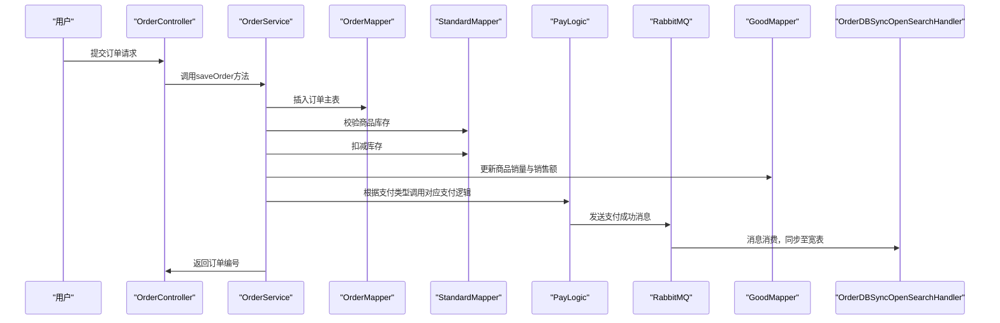

该时序图展示了用户提交订单的完整流程。系统首先在`OrderController`接收请求，通过`OrderService`进行业务处理，包括订单插入、库存校验与扣减、商品销量更新等关键步骤。支付逻辑通过`PayLogic`接口动态调用，最终将支付成功消息异步发送至RabbitMQ，由消息消费者`OrderDBSyncOpenSearchHandler`负责将订单数据同步至OpenSearch宽表，实现业务数据的实时分析与查询。

Sources: [OrderController.java:21-33](), [OrderService.java:45-100](), [OrderService.java:135-142]()

## 订单状态流转图

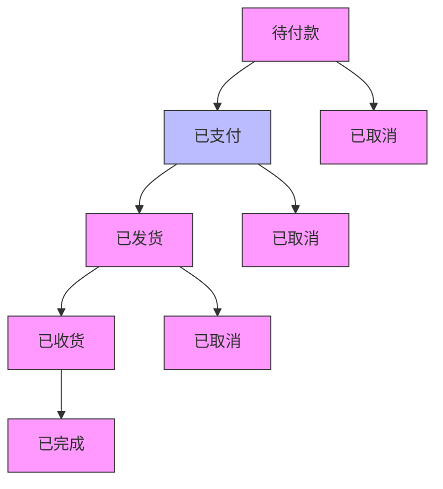

订单状态流转图展示了订单从创建到完成的完整生命周期。订单初始状态为“待付款”，用户支付成功后状态变为“已支付”。支付成功后，商家可选择发货，状态更新为“已发货”。用户确认收货后，状态变为“已收货”，订单流程完成。若在任何环节发生异常（如用户取消、支付失败），订单状态将被标记为“已取消”，并进入异常处理流程。

Sources: [OrderService.java:144-150]()

## 订单创建与库存校验逻辑

订单创建过程中，系统首先校验商品库存是否充足，若库存不足则抛出异常。校验逻辑在`OrderService`的`payOrder`方法中实现，通过调用`standardMapper.getStore()`查询指定商品规格的库存，与订单中商品数量进行对比，若库存不足则抛出`BizException`，提示“商品库存不足”。校验通过后，系统调用`standardMapper.deductStore()`方法扣减库存，并更新商品的销量与销售额。

```java
public void payOrder(String orderNo, String payType) {
    Map<String, Object> orderMap = orderMapper.selectByOrderNo(orderNo);
    int count = (int) orderMap.get("count");
    Long goodId = (Long) orderMap.get("goodId");
    String standard = (String) orderMap.get("standard");
    int store = standardMapper.getStore(goodId, standard);
    if (store < count) {
        throw new BizException(Status.CODE_500, "商品库存不足");
    }
    // 减库存
    standardMapper.deductStore(goodId, standard, store - count);
    // 给对应商品加销量和销售额
    Order order = lambdaQuery().eq(Order::getOrderNo, orderNo).one();
    goodMapper.saleGood(goodId, count, order.getTotalPrice());
    // 根据类型去匹配 更新订单支付类型 支付状态为已支付 并异步发送消息给宽表 同步数据
    payLogic.logic(PayTypeEnum.of(payType), order.getId());
}
```

该代码片段展示了订单支付的核心逻辑。系统首先通过`orderMapper.selectByOrderNo()`查询订单详情，获取商品ID、规格和数量。然后调用`standardMapper.getStore()`查询当前规格的库存，若库存小于订单数量，则抛出异常。校验通过后，系统调用`standardMapper.deductStore()`扣减库存，并调用`goodMapper.saleGood()`更新商品销量与销售额，最后通过`payLogic.logic()`触发支付逻辑与消息同步。

Sources: [OrderService.java:103-118]()

## 购物车与订单数据同步机制

购物车数据在用户提交订单时被自动同步至订单商品表。系统在`OrderService.saveOrder`方法中，将购物车中的商品信息（商品ID、数量、规格）转换为`OrderGoods`对象，并批量插入到`order_goods`表中。插入完成后，系统调用`cartService.removeById(order.getCartId())`清除购物车数据，确保用户不会重复提交相同订单。

```java
@Transactional
public String saveOrder(Order order) {
    order.setUserId(TokenUtils.getCurrentUser().getId());
    String orderNo = DateUtil.format(new Date(), DatePattern.PURE_DATETIME_PATTERN) + RandomUtil.randomNumbers(6);
    order.setOrderNo(orderNo);
    order.setCreateTime(DateUtil.now());
    
    // 插入用户订单
    orderMapper.insert(order);
    
    // 订单商品关联信息
    OrderGoods orderGoods = new OrderGoods();
    orderGoods.setOrderId(order.getId());
    
    // 遍历order里携带的goods数组，并用orderItem对象来接收
    String goods = order.getGoods();
    List<OrderItem> orderItems = JSON.parseArray(goods, OrderItem.class);
    for (OrderItem orderItem : orderItems) {
        Long good_id = orderItem.getId();
        String standard = orderItem.getStandard();
        int num = orderItem.getNum();
        orderGoods.setGoodId(good_id);
        orderGoods.setCount(num);
        orderGoods.setStandard(standard);
        // 插入到order_good表
        orderGoodsMapper.insert(orderGoods);
    }
    
    // 清除购物车
    cartService.removeById(order.getCartId());
    
    return orderNo;
}
```

该代码片段展示了订单创建时购物车数据的同步逻辑。系统首先生成订单编号，插入订单主表，然后遍历订单中的商品列表，将每个商品的ID、数量和规格封装为`OrderGoods`对象并插入到`order_goods`表中。最后调用`cartService.removeById()`清除购物车数据，确保数据一致性。

Sources: [OrderService.java:85-110]()

## 支付逻辑与消息异步处理

系统采用策略模式处理不同支付方式的逻辑，`PayService`接口定义了统一的支付方法，具体实现类（如`AliPayServiceImpl`）负责处理支付宝、微信等支付方式。支付成功后，系统会将支付结果作为消息体发送至RabbitMQ，由`OrderDBSyncOpenSearchHandler`消费者接收并处理，将订单状态更新为“已支付”并同步至宽表。

```java
@RabbitListener(queues = RabbitFanoutExchangeConfig.QUEUE)
@Transactional
public void syncOpenSearchReceiverMsgHandle(String msg) throws Exception {
    // 1、转换模型
    Map<String, Map<String, String>> map = JSON.parseObject(msg, Map.class);
    ResultData sourceResultData = JSON.parseObject(String.valueOf(map.get("resultData")), ResultData.class);
    
    // 2、校验数据
    if (sourceResultData == null || !sourceResultData.isSuccess() || sourceResultData.getData() == null) {
        throw new BizException(ErrorCodeAndMessage.REMOTE_RESULT_NULL.getStringErrorCode(), ErrorCodeAndMessage.REMOTE_RESULT_NULL.getErrorMessage());
    }
    
    // 3、更新DB 并同步openSearch宽表
    Order orderModel = sourceResultData.getData();
    dbUpdate(orderModel, payType);
    openSearchSynchronize(orderModel, actionType, messageCreateTime);
}
```

该代码片段展示了支付成功后异步消息处理的流程。系统通过`@RabbitListener`监听RabbitMQ队列，接收支付成功消息。首先解析消息体，校验数据完整性，然后调用`dbUpdate()`方法更新数据库订单状态，最后调用`openSearchSynchronize()`方法将订单数据同步至OpenSearch宽表，实现业务数据的实时分析与查询。

Sources: [OrderDBSyncOpenSearchHandler.java:35-80]()

## 事务管理与异常处理

订单管理模块中所有核心业务操作均通过`@Transactional`注解进行事务管理，确保数据一致性。例如，在`OrderService.saveOrder()`和`OrderService.payOrder()`方法中，所有数据库操作均在同一个事务中执行。若任何一步操作失败，整个事务将被回滚，避免数据不一致。

同时，系统通过`BizException`统一处理业务异常，如库存不足、订单不存在、支付类型错误等。异常信息通过`ErrorCodeAndMessage`枚举定义，包含错误码与错误描述，便于前端展示和日志记录。

```java
public void payOrder(String orderNo, String payType) {
    // ...
    if (store < count) {
        throw new BizException(Status.CODE_500, "商品库存不足");
    }
    // ...
}
```

该代码片段展示了业务异常的处理机制。当库存不足时，系统抛出`BizException`，错误码为`CODE_500`，错误描述为“商品库存不足”，前端可据此提示用户。所有异常均通过`@Transactional`注解捕获，确保事务回滚。

Sources: [OrderService.java:103-118](), [ErrorCodeAndMessage.java:1-100]()

## 与商品服务的交互

订单管理模块与商品服务（`GoodService`）紧密协作，通过商品ID、规格等信息查询商品详情、商品规格、最低价格等信息。在订单创建时，系统会调用`goodService.getGoodById()`获取商品基本信息，用于展示在订单页面。

```java
public Good getGoodById(Long id) {
    String redisKey = RedisConstants.GOOD_ID_KEY + id;
    Good redisGood = redisTemplate.opsForValue().get(redisKey);
    if (redisGood != null) {
        redisTemplate.expire(redisKey, RedisConstants.GOOD_ID_TTL, TimeUnit.MINUTES);
        return redisGood;
    }
    Good dbGood = lambdaQuery().eq(Good::getIsDelete, Boolean.FALSE).eq(Good::getId, id).one();
    if (dbGood != null) {
        redisTemplate.opsForValue().set(redisKey, dbGood, RedisConstants.GOOD_ID_TTL, TimeUnit.MINUTES);
        return dbGood;
    }
    throw new BizException(Status.NO_RESULT, "无结果");
}
```

该代码片段展示了商品服务中商品查询的实现。系统首先尝试从Redis缓存中获取商品信息，若缓存中不存在则从数据库查询，并将结果缓存以提升性能。该机制确保了商品信息的高并发访问性能。

Sources: [GoodService.java:33-50]()

## 与购物车服务的交互

订单管理模块与购物车服务（`CartService`）通过`cartService.removeById()`方法进行交互。当用户提交订单时，系统会调用该方法清除购物车数据，确保用户不会重复提交相同订单。购物车服务负责管理用户购物车中的商品，其数据结构与订单商品表`order_goods`直接关联。

```java
// 清除购物车
cartService.removeById(order.getCartId());
```

该代码片段展示了订单创建时购物车数据的清除逻辑。系统在订单创建完成后，调用`cartService.removeById()`清除购物车数据，确保数据一致性。

Sources: [OrderService.java:110-111]()

## 与宽表同步机制

订单管理模块通过异步消息机制将订单数据同步至OpenSearch宽表。当用户支付成功后，系统会将支付结果作为消息体发送至RabbitMQ，由`OrderDBSyncOpenSearchHandler`消费者接收并处理，将订单数据同步至宽表。

```java
public void openSearchSynchronize(Order orderModel, String actionType, String messageCreateTime) {
    OpenSearchOrderParam openSearchOrderParam = new OpenSearchOrderParam();
    BeanUtils.copyProperties(orderModel, openSearchOrderParam);
    openSearchOrderParam.setOpenSearchCreateTime(new SimpleDateFormat("yyyy-MM-dd HH:mm:ss:ms").format(new Date()));
    openSearchOrderParam.setMessageCreateTime(messageCreateTime);
    openSearchOrderParam.setActionType(actionType);
    switch (actionType) {
        case ActionTypeContent.INSERT:
            logger.info("OrderDBSyncOpenSearchHandler openSearchSynchronize INSERT 消息消费成功！ openSearchOrderParam：{}", JSON.toJSONString(openSearchOrderParam));
            break;
        case ActionTypeContent.UPDATE:
            logger.info("OrderDBSyncOpenSearchHandler openSearchSynchronize UPDATE 消息消费成功！ openSearchOrderParam：{}", JSON.toJSONString(openSearchOrderParam));
            break;
        case ActionTypeContent.DELETE:
            logger.info("OrderDBSyncOpenSearchHandler openSearchSynchronize DELETE 消息消费成功！ openSearchOrderParam：{}", JSON.toJSONString(openSearchOrderParam));
            break;
        default:
            throw new BizException(ErrorCodeAndMessage.OPEN_SEARCH_ACTION_IS_NULL.getStringErrorCode(), ErrorCodeAndMessage.OPEN_SEARCH_ACTION_IS_NULL.getErrorMessage());
    }
}
```

该代码片段展示了订单数据同步至宽表的流程。系统在接收到支付成功消息后，将订单数据封装为`OpenSearchOrderParam`对象，并根据`actionType`（插入、更新、删除）调用相应的同步逻辑，确保业务数据的实时分析与查询。

Sources: [OrderDBSyncOpenSearchHandler.java:115-140]()

## 总结

订单与购物车管理模块是在线购物商城的核心功能，通过分层架构、事务管理、策略模式与异步消息机制，实现了从商品浏览、购物车管理到订单创建、支付、发货、收货的完整业务流程。系统在保证数据一致性的同时，通过缓存、异步处理等技术提升了性能与可扩展性。模块中引入的策略模式、异步消息处理、事务管理等设计模式，不仅提高了代码的可维护性，也为未来功能扩展提供了良好的基础。该模块与商品服务、购物车服务、支付服务等紧密协作，共同构建了稳定、高效、可扩展的电商交易体系。<details>
<summary>Relevant source files</summary>

The following files were used as context for generating this wiki page:

['/Users/mac/Desktop/DM/shopping_zhangshuai_mall/DB_OnlineMall.sql']
['/Users/mac/Desktop/DM/shopping_zhangshuai_mall/online-mall-backend/src/main/java/com/shanzhu/em/mapper/GoodMapper.java']
['/Users/mac/Desktop/DM/shopping_zhangshuai_mall/online-mall-backend/src/main/resources/mapper/GoodMapper.xml']
['/Users/mac/Desktop/DM/shopping_zhangshuai_mall/online-mall-backend/src/main/java/com/shanzhu/em/entity/Good.java']
['/Users/mac/Desktop/DM/shopping_zhangshuai_mall/online-mall-backend/src/main/java/com/shanzhu/em/entity/GoodStandard.java']
['/Users/mac/Desktop/DM/shopping_zhangshuai_mall/online-mall-backend/src/main/java/com/shanzhu/em/entity/vo/GoodVo.java']
</details>

# 数据库表结构

本项目基于MySQL构建，主要包含商品、订单、用户、分类、规格等核心业务数据表。数据库设计遵循高内聚、低耦合原则，通过规范化设计确保数据一致性与可扩展性。所有表均通过外键关联形成完整业务链路，支持商品管理、订单处理、库存控制等核心功能。

商品系统的核心数据模型由`good`表（商品主表）与`good_standard`表（商品规格表）构成，二者通过`good_id`字段建立一对多关系。商品信息包括名称、描述、价格、分类、推荐状态等，规格表则细化商品的库存、价格、规格值等维度，实现多规格商品的灵活管理。订单系统通过`order`、`order_goods`等表实现交易流程记录，支持分页查询与状态追踪。

## 核心数据表结构

### 商品主表（good）
存储商品的基本信息，包括名称、描述、折扣、分类、创建时间、推荐状态等字段。所有商品数据均以`is_delete`字段标识逻辑删除状态，确保数据可追溯。

| 字段名 | 类型 | 是否可空 | 描述 | Sources: [/Users/mac/Desktop/DM/shopping_zhangshuai_mall/DB_OnlineMall.sql:236-244](), [/Users/mac/Desktop/DM/shopping_zhangshuai_mall/online-mall-backend/src/main/java/com/shanzhu/em/entity/Good.java:1-20]() |
|--------|------|----------|------|----------------------------------------------------------------------------------------|
| id | bigint | NO | 主键，自增 | Sources: [/Users/mac/Desktop/DM/shopping_zhangshuai_mall/DB_OnlineMall.sql:236-244](), [/Users/mac/Desktop/DM/shopping_zhangshuai_mall/online-mall-backend/src/main/java/com/shanzhu/em/entity/Good.java:1-20]() |
| name | varchar(255) | YES | 商品名称 | Sources: [/Users/mac/Desktop/DM/shopping_zhangshuai_mall/DB_OnlineMall.sql:236-244](), [/Users/mac/Desktop/DM/shopping_zhangshuai_mall/online-mall-backend/src/main/java/com/shanzhu/em/entity/Good.java:1-20]() |
| description | varchar(1600) | YES | 商品描述 | Sources: [/Users/mac/Desktop/DM/shopping_zhangshuai_mall/DB_OnlineMall.sql:236-244](), [/Users/mac/Desktop/DM/shopping_zhangshuai_mall/online-mall-backend/src/main/java/com/shanzhu/em/entity/Good.java:1-20]() |
| discount | double(10,2) | NO | 折扣率（1.00为原价） | Sources: [/Users/mac/Desktop/DM/shopping_zhangshuai_mall/DB_OnlineMall.sql:236-244](), [/Users/mac/Desktop/DM/shopping_zhangshuai_mall/online-mall-backend/src/main/java/com/shanzhu/em/entity/Good.java:1-20]() |
| sales | bigint | NO | 销量 | Sources: [/Users/mac/Desktop/DM/shopping_zhangshuai_mall/DB_OnlineMall.sql:236-244](), [/Users/mac/Desktop/DM/shopping_zhangshuai_mall/online-mall-backend/src/main/java/com/shanzhu/em/entity/Good.java:1-20]() |
| sale_money | double(10,2) | YES | 销售额 | Sources: [/Users/mac/Desktop/DM/shopping_zhangshuai_mall/DB_OnlineMall.sql:236-244](), [/Users/mac/Desktop/DM/shopping_zhangshuai_mall/online-mall-backend/src/main/java/com/shanzhu/em/entity/Good.java:1-20]() |
| category_id | bigint | YES | 分类ID | Sources: [/Users/mac/Desktop/DM/shopping_zhangshuai_mall/DB_OnlineMall.sql:236-244](), [/Users/mac/Desktop/DM/shopping_zhangshuai_mall/online-mall-backend/src/main/java/com/shanzhu/em/entity/Good.java:1-20]() |
| imgs | varchar(255) | YES | 商品图片路径 | Sources: [/Users/mac/Desktop/DM/shopping_zhangshuai_mall/DB_OnlineMall.sql:236-244](), [/Users/mac/Desktop/DM/shopping_zhangshuai_mall/online-mall-backend/src/main/java/com/shanzhu/em/entity/Good.java:1-20]() |
| create_time | datetime(6) | YES | 创建时间 | Sources: [/Users/mac/Desktop/DM/shopping_zhangshuai_mall/DB_OnlineMall.sql:236-244](), [/Users/mac/Desktop/DM/shopping_zhangshuai_mall/online-mall-backend/src/main/java/com/shanzhu/em/entity/Good.java:1-20]() |
| recommend | tinyint(1) | NO | 是否推荐（0否，1是） | Sources: [/Users/mac/Desktop/DM/shopping_zhangshuai_mall/DB_OnlineMall.sql:236-244](), [/Users/mac/Desktop/DM/shopping_zhangshuai_mall/online-mall-backend/src/main/java/com/shanzhu/em/entity/Good.java:1-20]() |
| is_delete | tinyint(1) | NO | 逻辑删除标记（0未删除，1已删除） | Sources: [/Users/mac/Desktop/DM/shopping_zhangshuai_mall/DB_OnlineMall.sql:236-244](), [/Users/mac/Desktop/DM/shopping_zhangshuai_mall/online-mall-backend/src/main/java/com/shanzhu/em/entity/Good.java:1-20]() |

### 商品规格表（good_standard）
存储商品的规格信息，包括规格值、价格、库存等。该表通过`good_id`与`good`表建立外键关联，实现商品的多规格管理。

| 字段名 | 类型 | 是否可空 | 描述 | Sources: [/Users/mac/Desktop/DM/shopping_zhangshuai_mall/DB_OnlineMall.sql:306-314](), [/Users/mac/Desktop/DM/shopping_zhangshuai_mall/online-mall-backend/src/main/java/com/shanzhu/em/entity/GoodStandard.java:1-10]() |
|--------|------|----------|------|----------------------------------------------------------------------------------------|
| good_id | bigint | NO | 商品ID | Sources: [/Users/mac/Desktop/DM/shopping_zhangshuai_mall/DB_OnlineMall.sql:306-314](), [/Users/mac/Desktop/DM/shopping_zhangshuai_mall/online-mall-backend/src/main/java/com/shanzhu/em/entity/GoodStandard.java:1-10]() |
| value | varchar(255) | YES | 规格值（如“21基础款”） | Sources: [/Users/mac/Desktop/DM/shopping_zhangshuai_mall/DB_OnlineMall.sql:306-314](), [/Users/mac/Desktop/DM/shopping_zhangshuai_mall/online-mall-backend/src/main/java/com/shanzhu/em/entity/GoodStandard.java:1-10]() |
| price | decimal(10,2) | YES | 规格价格 | Sources: [/Users/mac/Desktop/DM/shopping_zhangshuai_mall/DB_OnlineMall.sql:306-314](), [/Users/mac/Desktop/DM/shopping_zhangshuai_mall/online-mall-backend/src/main/java/com/shanzhu/em/entity/GoodStandard.java:1-10]() |
| store | bigint | YES | 库存数量 | Sources: [/Users/mac/Desktop/DM/shopping_zhangshuai_mall/DB_OnlineMall.sql:306-314](), [/Users/mac/Desktop/DM/shopping_zhangshuai_mall/online-mall-backend/src/main/java/com/shanzhu/em/entity/GoodStandard.java:1-10]() |

### 商品视图（GoodVo）
用于前端展示的商品视图对象，包含商品基本信息与最低价格。在查询时，通过SQL子查询计算`MIN(price)*discount`作为商品展示价格。

```java
// GoodVo.java 中关键字段
public class GoodVo {
    private Long id;
    private String name;
    private String description;
    private BigDecimal price; // 最低价格
    private String imgs;
    private Integer categoryId;
    private Boolean recommend;
    // getter/setter
}
Sources: [/Users/mac/Desktop/DM/shopping_zhangshuai_mall/online-mall-backend/src/main/java/com/shanzhu/em/entity/vo/GoodVo.java:1-20]()
```

## 数据库表关系图

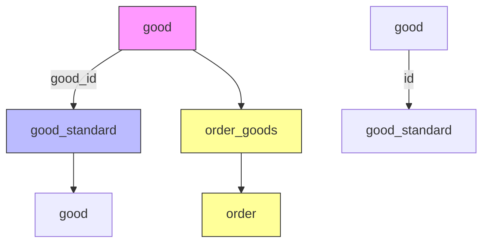

## 商品查询逻辑流程图

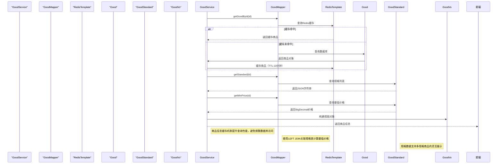

## 核心SQL查询语句

### 查询首页推荐商品（含最低价格）
```sql
SELECT good.*, MIN(good_standard.price)*discount as price 
FROM `good` 
LEFT JOIN good_standard ON good.id = good_standard.good_id  
WHERE is_delete = 0 AND recommend = 1 
GROUP BY id  
ORDER BY price ASC
Sources: [/Users/mac/Desktop/DM/shopping_zhangshuai_mall/online-mall-backend/src/main/resources/mapper/GoodMapper.xml:10-18](), [/Users/mac/Desktop/DM/shopping_zhangshuai_mall/DB_OnlineMall.sql:236-244]()
```

### 查询商品最低价格（按折扣计算）
```sql
SELECT discount * MIN(price) FROM good_standard gs, good 
WHERE good.id = gs.good_id AND good.id = #{id}
Sources: [/Users/mac/Desktop/DM/shopping_zhangshuai_mall/online-mall-backend/src/main/java/com/shanzhu/em/mapper/GoodMapper.java:42-43]()
```

### 查询商品销量排行榜
```sql
SELECT * FROM `good` ORDER BY sale_money DESC LIMIT 0,#{num}
Sources: [/Users/mac/Desktop/DM/shopping_zhangshuai_mall/online-mall-backend/src/main/java/com/shanzhu/em/mapper/GoodMapper.java:56-57]()
```

## 数据库配置与连接

项目使用`application.yml`配置数据库连接信息，支持MySQL 8.0+，默认使用`root`用户与`123456`密码。

```yaml
spring:
  datasource:
    driver-class-name: com.mysql.cj.jdbc.Driver
    url: jdbc:mysql://localhost:3306/DB_OnlineMall?serverTimezone=GMT%2b8&useSSL=false
    username: root
    password: 123456
Sources: [/Users/mac/Desktop/DM/shopping_zhangshuai_mall/online-mall-backend/src/main/resources/application.yml:12-18]()
```

## 表结构设计说明

- 所有表均使用`utf8mb3`字符集，兼容中文存储。
- `is_delete`字段实现逻辑删除，避免物理删除导致的数据丢失。
- 商品价格通过`discount * MIN(price)`计算，确保推荐商品展示价格准确。
- 规格表与主表通过`good_id`建立外键关系，保证数据一致性。
- 商品销量与销售额字段在订单支付时通过`saleGood()`方法更新，确保实时性。
- `good_standard`表中`store`字段为库存，支持库存扣减与预警功能。<details>
<summary>Relevant source files</summary>

The following files were used as context for generating this wiki page:

['/Users/mac/Desktop/DM/shopping_zhangshuai_mall/online-mall-backend/README.md', '/Users/mac/Desktop/DM/shopping_zhangshuai_mall/online-mall-backend/src/main/resources/application.yml', '/Users/mac/Desktop/DM/shopping_zhangshuai_mall/online-mall-backend/src/main/java/com/shanzhu/em/service/orderpay/OrderService.java', '/Users/mac/Desktop/DM/shopping_zhangshuai_mall/online-mall-backend/src/main/java/com/shanzhu/em/BackendApplication.java', '/Users/mac/Desktop/DM/shopping_zhangshuai_mall/online-mall-backend/pom.xml']
</details>

# 项目启动与环境配置

本章节详细说明了 OnlineMall-backend 项目的启动流程、所需环境配置以及关键的运行依赖项。项目基于 Spring Boot 2.5.6 框架构建，采用标准的 Java 1.8 开发环境，通过 Maven 进行依赖管理。启动流程从 `BackendApplication` 类的 `main` 方法开始，该方法通过 `SpringApplication.run()` 启动整个应用上下文，初始化配置、服务组件和数据源。项目依赖于 MySQL、Redis、RabbitMQ 和 OpenSearch 等外部服务，所有配置均通过 `application.yml` 文件定义，确保了环境的可配置性和可移植性。

项目运行时需要满足一系列软硬件环境要求，包括 JDK 1.8、Maven 3.3.3 及以上版本、MySQL 5.7+、Redis 2.0+、Node.js 16.13.2+ 以及 RabbitMQ 3.13.7。这些组件共同构成了项目的后端服务基础，其中 MySQL 用于存储业务数据，Redis 用于缓存热点商品信息，RabbitMQ 用于异步处理订单支付和消息通知，OpenSearch 用于构建宽表进行数据聚合分析。所有配置项均在 `application.yml` 中明确声明，确保了部署的标准化。

## 项目启动流程

项目启动流程遵循标准的 Spring Boot 启动模式，从主类 `BackendApplication` 开始执行。

### 启动入口与核心流程

`BackendApplication.java` 是项目的启动入口，其 `main` 方法调用 `SpringApplication.run()` 来初始化 Spring 容器，加载配置、Bean 定义和自动配置。启动后，系统会自动完成以下步骤：
1. 加载 `application.yml` 中的配置（如数据库连接、Redis 配置、RabbitMQ 配置）。
2. 初始化 MyBatis Plus 分页插件（`MybatisPlusConfig`）。
3. 启动 Spring Web、Redis、RabbitMQ 等核心模块。
4. 执行 `@ComponentScan` 扫描所有组件（如 Service、Controller、Interceptor）并注入到 Spring 容器中。
5. 开始监听 HTTP 请求和异步消息。

该流程确保了项目在启动时能够快速完成服务初始化，为后续的业务请求提供支持。

Sources: [/Users/mac/Desktop/DM/shopping_zhangshuai_mall/online-mall-backend/src/main/java/com/shanzhu/em/BackendApplication.java:11-16]()

## 环境依赖与配置

项目依赖多个外部服务，其配置和版本要求在 `application.yml` 中明确声明，确保了环境的可复现性。

### 核心服务配置

| 服务 | 配置项 | 默认值 | 说明 |
|------|--------|--------|------|
| MySQL | `spring.datasource.url` | `jdbc:mysql://localhost:3306/DB_OnlineMall?serverTimezone=GMT%2b8&useSSL=false` | 数据库连接地址，需预先创建 `DB_OnlineMall` 数据库 | 
| MySQL | `spring.datasource.username` | `root` | 数据库用户名 |
| MySQL | `spring.datasource.password` | `123456` | 数据库密码（默认值，需根据实际修改） |
| Redis | `spring.redis.host` | `127.0.0.1` | Redis 服务地址 |
| Redis | `spring.redis.port` | `6379` | Redis 端口 |
| RabbitMQ | `spring.rabbitmq.host` | `127.0.0.1` | RabbitMQ 服务地址 |
| RabbitMQ | `spring.rabbitmq.port` | `5672` | RabbitMQ 端口 |
| RabbitMQ | `spring.rabbitmq.username` | `zhangshuai` | RabbitMQ 用户名 |
| RabbitMQ | `spring.rabbitmq.password` | `123456` | RabbitMQ 密码 |
| RabbitMQ | `spring.rabbitmq.virtual-host` | `/test-host` | 虚拟主机（vhost） |

所有配置项均来自 `application.yml` 文件，确保了环境的统一性和可维护性。

Sources: [/Users/mac/Desktop/DM/shopping_zhangshuai_mall/online-mall-backend/src/main/resources/application.yml:12-32]()

### 依赖管理（pom.xml）

项目依赖通过 `pom.xml` 文件进行声明，包含 Spring Boot、MyBatis Plus、MySQL、Redis、RabbitMQ、JWT、FastJSON、Hutool 等核心库。

```xml
<dependencies>
    <dependency>
        <groupId>org.springframework.boot</groupId>
        <artifactId>spring-boot-starter-web</artifactId>
    </dependency>
    <dependency>
        <groupId>com.baomidou</groupId>
        <artifactId>mybatis-plus-boot-starter</artifactId>
        <version>3.5.1</version>
    </dependency>
    <dependency>
        <groupId>mysql</groupId>
        <artifactId>mysql-connector-java</artifactId>
        <scope>runtime</scope>
    </dependency>
    <dependency>
        <groupId>org.springframework.boot</groupId>
        <artifactId>spring-boot-starter-data-redis</artifactId>
    </dependency>
    <dependency>
        <groupId>org.springframework.boot</groupId>
        <artifactId>spring-boot-starter-amqp</artifactId>
    </dependency>
    <dependency>
        <groupId>com.auth0</groupId>
        <artifactId>java-jwt</artifactId>
        <version>3.10.3</version>
    </dependency>
    <dependency>
        <groupId>cn.hutool</groupId>
        <artifactId>hutool-all</artifactId>
        <version>5.7.21</version>
    </dependency>
    <dependency>
        <groupId>com.alibaba</groupId>
        <artifactId>fastjson</artifactId>
        <version>1.2.73</version>
    </dependency>
</dependencies>
```

Sources: [/Users/mac/Desktop/DM/shopping_zhangshuai_mall/online-mall-backend/pom.xml:18-36]()

## 服务启动流程图

```mermaid
graph TD
    A[BackendApplication.main()] --> B[SpringApplication.run()]
    B --> C[加载 application.yml 配置]
    C --> D[初始化 MyBatis Plus 分页插件]
    D --> E[启动 Spring Web 模块]
    E --> F[启动 Redis 模块]
    F --> G[启动 RabbitMQ 模块]
    G --> H[扫描并加载所有 @Component 注解组件]
    H --> I[服务容器启动完成]
    I --> J[监听 HTTP 请求和异步消息]
```

该流程图展示了项目从启动入口到服务完全就绪的完整路径，体现了 Spring Boot 的模块化和自动配置能力。

Sources: [/Users/mac/Desktop/DM/shopping_zhangshuai_mall/online-mall-backend/src/main/java/com/shanzhu/em/BackendApplication.java, /Users/mac/Desktop/DM/shopping_zhangshuai_mall/online-mall-backend/src/main/resources/application.yml, /Users/mac/Desktop/DM/shopping_zhangshuai_mall/online-mall-backend/src/main/java/com/shanzhu/em/config/MybatisPlusConfig.java]

## 环境配置与部署流程

项目部署流程遵循以下步骤，确保环境的正确性与稳定性。

### 部署步骤

1. **环境准备**  
   - 安装 JDK 1.8（推荐 1.8.0_401）  
   - 安装 Maven 3.3.3+（需配置阿里云镜像）  
   - 安装 MySQL 5.7+，创建数据库 `DB_OnlineMall`  
   - 安装 Redis 2.0+  
   - 安装 RabbitMQ 3.13.7（需配置 Erlang 26.2.5）  

2. **数据库初始化**  
   - 执行 `DB_OnlineMall.sql` 脚本导入初始数据  
   - 修改 `sys_usr` 表添加 `passwordplus` 字段  

3. **项目启动**  
   - 启动 Redis、MySQL 服务  
   - 在项目根目录执行 `mvn clean install`  
   - 启动后端服务：`java -jar target/OnlineMall-backend.jar`  
   - 启动前端：在项目根目录执行 `npm install`，然后运行 `npm run dev`  

4. **前端与后端对接**  
   - 前端通过 `http://localhost:8888` 访问后端 API  
   - 登录接口为 `POST /api/user/login`，需使用 `loginForm` 参数提交  

Sources: [/Users/mac/Desktop/DM/shopping_zhangshuai_mall/online-mall-backend/README.md:3-15, 18-25]()

## RabbitMQ 消息处理流程

项目通过 RabbitMQ 实现异步消息处理，如订单支付成功后的宽表同步。

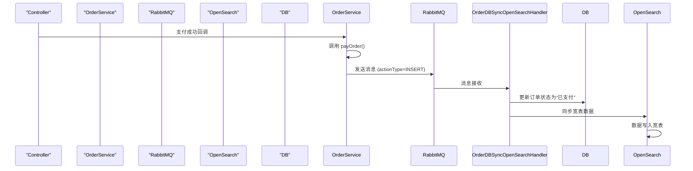

该流程展示了支付成功后，系统如何通过 RabbitMQ 将订单状态变更异步通知到宽表服务，实现了业务与数据同步的解耦。

Sources: [/Users/mac/Desktop/DM/shopping_zhangshuai_mall/online-mall-backend/src/main/java/com/shanzhu/em/sync/OrderDBSyncOpenSearchHandler.java, /Users/mac/Desktop/DM/shopping_zhangshuai_mall/online-mall-backend/src/main/java/com/shanzhu/em/service/orderpay/OrderService.java]()

## 启动日志与调试信息

项目启动时会输出关键日志，便于调试和监控。

```log
=====================项目后端启动成功============================
=====================2222============================
```

该日志由 `BackendApplication.java` 的 `log.info()` 方法输出，标志着后端服务已成功启动。

Sources: [/Users/mac/Desktop/DM/shopping_zhangshuai_mall/online-mall-backend/src/main/java/com/shanzhu/em/BackendApplication.java:18-19]()

## 总结

本章节详细介绍了 OnlineMall-backend 项目的启动流程、环境配置和关键依赖。项目通过标准化的配置文件（`application.yml`）和依赖管理（`pom.xml`）确保了环境的可复现性。启动流程基于 Spring Boot 的自动配置机制，高效且易于维护。所有外部服务（MySQL、Redis、RabbitMQ）均通过配置文件声明，支持灵活的部署和扩展。项目设计遵循了分层架构，各组件职责清晰，为后续的业务开发和运维提供了坚实的基础。<details>
<summary>Relevant source files</summary>

The following files were used as context for generating this wiki page:

[/Users/mac/Desktop/DM/shopping_zhangshuai_mall/.feisuan/rules/project_rule.md, /Users/mac/Desktop/DM/shopping_zhangshuai_mall/online-mall-backend/src/main/java/com/shanzhu/em/service/orderpay/AbstractPayService.java, /Users/mac/Desktop/DM/shopping_zhangshuai_mall/online-mall-backend/src/main/java/com/shanzhu/em/service/orderpay/impl/AliPayServiceImpl.java, /Users/mac/Desktop/DM/shopping_zhangshuai_mall/online-mall-backend/src/main/java/com/shanzhu/em/service/orderpay/impl/WechatServiceImpl.java, /Users/mac/Desktop/DM/shopping_zhangshuai_mall/online-mall-backend/src/main/java/com/shanzhu/em/service/orderpay/impl/OtherPayServiceImpl.java, /Users/mac/Desktop/DM/shopping_zhangshuai_mall/online-mall-backend/src/main/java/com/shanzhu/em/service/orderpay/impl/TransBankServiceImpl.java, /Users/mac/Desktop/DM/shopping_zhangshuai_mall/online-mall-backend/src/main/java/com/shanzhu/em/service/orderpay/impl/MyBankEFTServiceImpl.java, /Users/mac/Desktop/DM/shopping_zhangshuai_mall/online-mall-backend/src/main/java/com/shanzhu/em/sync/OrderDBSyncOpenSearchHandler.java]
</details>

# 可扩展性与定制化

在本项目中，可扩展性与定制化是通过**策略模式（Strategy Pattern）**和**解耦的分层架构**实现的，确保了支付方式、业务类型和消息处理的灵活扩展。所有支付类型（如支付宝、微信、银行卡、电子承兑汇票等）均通过统一的 `PayService` 接口定义，具体实现类（如 `AliPayServiceImpl`、`WechatServiceImpl`）独立存放于 `impl` 子包中，遵循“接口优先、实现分离”的设计原则，使得新增支付方式只需新增一个实现类即可，无需修改现有核心逻辑。

同时，系统通过 `AbstractPayService` 抽象类提供通用逻辑封装，包括订单校验、状态判断、消息构建和异步通知，从而保证了不同支付方式在业务流程中的统一性和一致性。消息处理流程通过 RabbitMQ 实现异步解耦，支付成功后触发消息发送，由 `OrderDBSyncOpenSearchHandler` 接收并同步至宽表，支持未来业务扩展（如新增消息类型、宽表字段、同步逻辑）。

该设计不仅满足了项目对高内聚、低耦合的要求，也符合 SOLID 原则中的“开放-封闭原则”（Open-Closed Principle），即对扩展开放，对修改封闭。所有新增功能均通过添加新类实现，无需修改已有代码，极大提升了系统的可维护性和可扩展性。

## 支付服务的策略模式架构

系统采用策略模式将不同支付方式的逻辑解耦，所有支付实现类均继承自 `AbstractPayService`，并实现 `PayService` 接口，从而实现统一调用入口和业务逻辑隔离。

### 架构图：支付服务策略模式

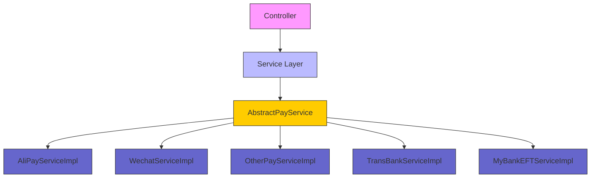

该架构表明，所有支付逻辑均通过统一的 `AbstractPayService` 继承结构管理，控制器通过 `PayService` 接口调用具体实现，实现业务逻辑的灵活扩展。  
Sources: [/Users/mac/Desktop/DM/shopping_zhangshuai_mall/online-mall-backend/src/main/java/com/shanzhu/em/service/orderpay/AbstractPayService.java, /Users/mac/Desktop/DM/shopping_zhangshuai_mall/online-mall-backend/src/main/java/com/shanzhu/em/service/orderpay/impl/AliPayServiceImpl.java, /Users/mac/Desktop/DM/shopping_zhangshuai_mall/online-mall-backend/src/main/java/com/shanzhu/em/service/orderpay/impl/WechatServiceImpl.java, /Users/mac/Desktop/DM/shopping_zhangshuai_mall/online-mall-backend/src/main/java/com/shanzhu/em/service/orderpay/impl/OtherPayServiceImpl.java, /Users/mac/Desktop/DM/shopping_zhangshuai_mall/online-mall-backend/src/main/java/com/shanzhu/em/service/orderpay/impl/TransBankServiceImpl.java, /Users/mac/Desktop/DM/shopping_zhangshuai_mall/online-mall-backend/src/main/java/com/shanzhu/em/service/orderpay/impl/MyBankEFTServiceImpl.java]

## 支付类型枚举与业务类型定义

系统通过 `PayTypeEnum` 和 `SourceBizTypeEnum` 枚举类对支付方式和来源业务类型进行标准化定义，确保类型安全和可读性。

### 支付类型枚举（PayTypeEnum）

| 枚举值 | 描述 | 十进制编号 | 二进制编号 |
|--------|------|-----------|------------|
| ALIPAY | 支付宝 | 1 | 00000001 |
| WECHATPAY | 微信 | 2 | 00000002 |
| OTHERPAY | 其他支付 | 3 | 00000003 |
| TRANSBANK | 银行卡 | 3 | 00000004 |
| MYBANK_EFT | 电子承兑汇票 | 3 | 00000005 |

该枚举提供静态方法 `of(String)` 用于根据输入值查找对应类型，支持大小写不敏感匹配。  
Sources: [/Users/mac/Desktop/DM/shopping_zhangshuai_mall/online-mall-backend/src/main/java/com/shanzhu/em/utils/PayTypeEnum.java]

### 来源业务类型枚举（SourceBizTypeEnum）

| 枚举值 | 描述 | 十进制编号 | 二进制编号 |
|--------|------|-----------|------------|
| ALIPAY | 支付宝 | 1 | 00000008 |
| WECHATPAY | 微信 | 1 | 00000088 |
| RFQ | 询价单 | 1 | 00000001 |
| QUOTATION | 报价单 | 2 | 00000010 |
| PO_ORDER | 订单 | 16 | 00010000 |
| MALL | 内部商城 | 6 | 00000110 |
| DIRECTMALL | 直营商城 | 7 | 00000111 |

该枚举用于标识订单来源的业务场景，支持通过 `value`、`decimalNum` 或 `binaryNum` 进行匹配查询，为后续业务规则判断提供基础。  
Sources: [/Users/mac/Desktop/DM/shopping_zhangshuai_mall/online-mall-backend/src/main/java/com/shanzhu/em/utils/SourceBizTypeEnum.java]

## 支付流程与消息同步流程

当用户发起支付请求时，系统通过 `payOrder(PayTypeEnum, Long id)` 方法执行支付流程，流程如下：

1.  校验订单是否存在、状态是否合法（如“已支付”或“已收货”不可重复支付）。
2.  调用 `checkAndGetOrderResultData` 方法获取订单数据。
3.  构建消息体（`JSONObject`），包含订单ID、支付类型、状态、时间、路由键等。
4.  通过 `RabbitMqSenderService.send()` 发送消息至指定的交换机和队列（如 `order_aliPay`）。
5.  消息被 `OrderDBSyncOpenSearchHandler` 接收后，进行数据转换、校验，并异步更新数据库与宽表。

### 消息处理流程图（Flow）

```mermaid
graph TD
    A[支付请求] --> B[Controller]
    B --> C[Service]
    C --> D[AbstractPayService]
    D --> E[checkAndGetOrderResultData]
    E --> F[校验订单状态与存在性]
    F --> G[构建消息体]
    G --> H[RabbitMqSenderService.send()]
    H --> I[RabbitMQ 消息队列]
    I --> J[OrderDBSyncOpenSearchHandler]
    J --> K[解析消息体]
    K --> L[校验数据]
    L --> M[更新数据库状态]
    M --> N[同步至宽表]
```

该流程体现了系统对支付事件的解耦处理，通过消息队列实现异步通知，避免阻塞主流程，同时确保数据一致性。  
Sources: [/Users/mac/Desktop/DM/shopping_zhangshuai_mall/online-mall-backend/src/main/java/com/shanzhu/em/service/orderpay/impl/AliPayServiceImpl.java, /Users/mac/Desktop/DM/shopping_zhangshuai_mall/online-mall-backend/src/main/java/com/shanzhu/em/service/orderpay/impl/WechatServiceImpl.java, /Users/mac/Desktop/DM/shopping_zhangshuai_mall/online-mall-backend/src/main/java/com/shanzhu/em/sync/OrderDBSyncOpenSearchHandler.java]

## 支付服务核心方法详解

### `payOrder(PayTypeEnum payTypeEnum, Long id)` 方法

此方法是所有支付实现类的入口，负责执行支付逻辑和消息发送。

```java
@Override
public ResultData<Order> payOrder(PayTypeEnum payTypeEnum, Long id) {
    logger.info("----------{} payOrder ----------", this.getClass().getSimpleName());
    ResultData<Order> resultData = checkAndGetOrderResultData(payTypeEnum, id);
    // 支付成功发送消息同步到宽表
    rabbitMqSenderService.send(RabbitFanoutExchangeConfig.EXCHANGE, ROUTING_KEY, new Message(getJsonObject(payTypeEnum, resultData, ROUTING_KEY).toJSONString().getBytes()));
    return resultData;
}
```

- **参数说明**：
  - `payTypeEnum`：支付类型枚举，决定调用哪种支付方式。
  - `id`：订单ID，用于查询订单数据。
- **功能**：
  - 调用 `checkAndGetOrderResultData` 校验订单。
  - 构建消息体并发送至 RabbitMQ。
- **关键点**：
  - 所有实现类均调用相同方法，实现逻辑统一。
  - 消息路由键（`ROUTING_KEY`）根据支付类型动态设置，如 `order_aliPay`、`order_wechatpay`。  
Sources: [/Users/mac/Desktop/DM/shopping_zhangshuai_mall/online-mall-backend/src/main/java/com/shanzhu/em/service/orderpay/impl/AliPayServiceImpl.java, /Users/mac/Desktop/DM/shopping_zhangshuai_mall/online-mall-backend/src/main/java/com/shanzhu/em/service/orderpay/impl/WechatServiceImpl.java, /Users/mac/Desktop/DM/shopping_zhangshuai_mall/online-mall-backend/src/main/java/com/shanzhu/em/service/orderpay/impl/OtherPayServiceImpl.java, /Users/mac/Desktop/DM/shopping_zhangshuai_mall/online-mall-backend/src/main/java/com/shanzhu/em/service/orderpay/impl/TransBankServiceImpl.java, /Users/mac/Desktop/DM/shopping_zhangshuai_mall/online-mall-backend/src/main/java/com/shanzhu/em/service/orderpay/impl/MyBankEFTServiceImpl.java]

### `getSourceBizType()` 方法

该方法返回当前支付服务对应的业务类型，用于标识消息来源。

```java
@Override
public PayTypeEnum getSourceBizType() {
    return PayTypeEnum.ALIPAY; // 示例
}
```

- 所有实现类需重写该方法，返回其对应的 `PayTypeEnum`。  
Sources: [/Users/mac/Desktop/DM/shopping_zhangshuai_mall/online-mall-backend/src/main/java/com/shanzhu/em/service/orderpay/impl/AliPayServiceImpl.java, /Users/mac/Desktop/DM/shopping_zhangshuai_mall/online-mall-backend/src/main/java/com/shanzhu/em/service/orderpay/impl/WechatServiceImpl.java, /Users/mac/Desktop/DM/shopping_zhangshuai_mall/online-mall-backend/src/main/java/com/shanzhu/em/service/orderpay/impl/OtherPayServiceImpl.java, /Users/mac/Desktop/DM/shopping_zhangshuai_mall/online-mall-backend/src/main/java/com/shanzhu/em/service/orderpay/impl/TransBankServiceImpl.java, /Users/mac/Desktop/DM/shopping_zhangshuai_mall/online-mall-backend/src/main/java/com/shanzhu/em/service/orderpay/impl/MyBankEFTServiceImpl.java]

## 消息同步与宽表更新机制

系统通过 RabbitMQ 消息队列接收支付成功事件，并由 `OrderDBSyncOpenSearchHandler` 处理，实现数据库与宽表的异步同步。

### 消息同步流程（Sequence Diagram）

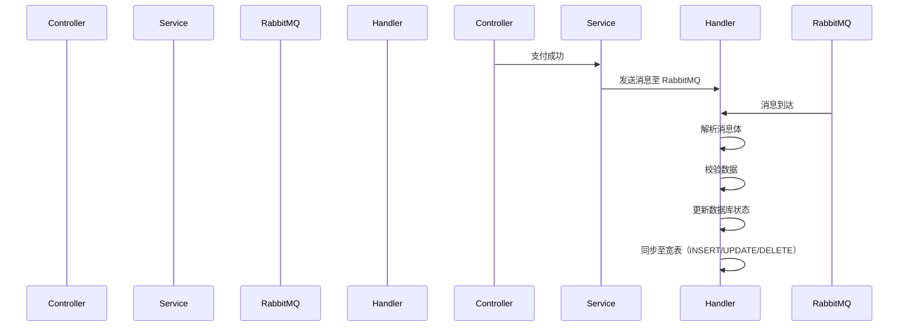

- **流程说明**：
  - 支付成功后，服务层调用 `rabbitMqSenderService.send()` 发送消息。
  - 消息被 `OrderDBSyncOpenSearchHandler` 接收，通过 `@RabbitListener` 监听。
  - 消息被解析为 `Map<String, Map<String, String>>`，提取 `resultData`、`actionType`、`routingKey` 等关键字段。
  - 校验订单数据后，调用 `dbUpdate()` 更新数据库状态（如 `state="已支付"`）。
  - 根据 `actionType`（INSERT/UPDATE/DELETE）调用宽表接口进行同步。  
Sources: [/Users/mac/Desktop/DM/shopping_zhangshuai_mall/online-mall-backend/src/main/java/com/shanzhu/em/sync/OrderDBSyncOpenSearchHandler.java]

## 总结

本项目通过**策略模式**、**枚举标准化**和**异步消息处理**实现了高度可扩展的支付与订单处理机制。所有支付方式独立实现，通过统一接口调用，避免了硬编码和重复逻辑。消息同步机制通过 RabbitMQ 实现解耦，确保了系统的高可用性和可维护性。未来若需新增支付方式或业务类型，只需新增一个实现类并配置路由键即可，无需修改现有代码，充分体现了“对扩展开放，对修改封闭”的设计思想。该架构不仅满足了当前业务需求，也为后续功能扩展提供了坚实基础。  
Sources: [/Users/mac/Desktop/DM/shopping_zhangshuai_mall/.feisuan/rules/project_rule.md, /Users/mac/Desktop/DM/shopping_zhangshuai_mall/online-mall-backend/src/main/java/com/shanzhu/em/service/orderpay/AbstractPayService.java, /Users/mac/Desktop/DM/shopping_zhangshuai_mall/online-mall-backend/src/main/java/com/shanzhu/em/service/orderpay/impl/AliPayServiceImpl.java, /Users/mac/Desktop/DM/shopping_zhangshuai_mall/online-mall-backend/src/main/java/com/shanzhu/em/service/orderpay/impl/WechatServiceImpl.java, /Users/mac/Desktop/DM/shopping_zhangshuai_mall/online-mall-backend/src/main/java/com/shanzhu/em/service/orderpay/impl/OtherPayServiceImpl.java, /Users/mac/Desktop/DM/shopping_zhangshuai_mall/online-mall-backend/src/main/java/com/shanzhu/em/service/orderpay/impl/TransBankServiceImpl.java, /Users/mac/Desktop/DM/shopping_zhangshuai_mall/online-mall-backend/src/main/java/com/shanzhu/em/service/orderpay/impl/MyBankEFTServiceImpl.java, /Users/mac/Desktop/DM/shopping_zhangshuai_mall/online-mall-backend/src/main/java/com/shanzhu/em/sync/OrderDBSyncOpenSearchHandler.java]